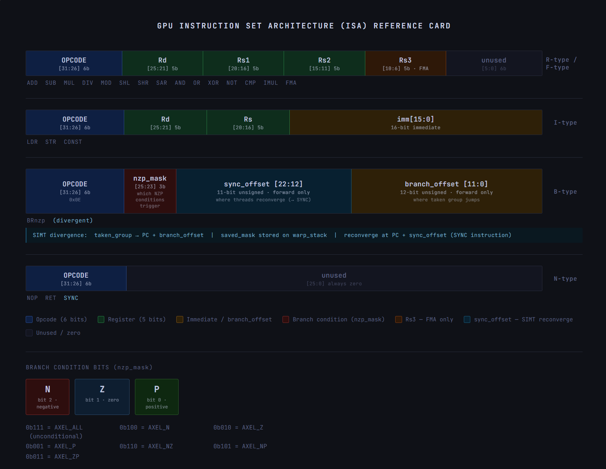
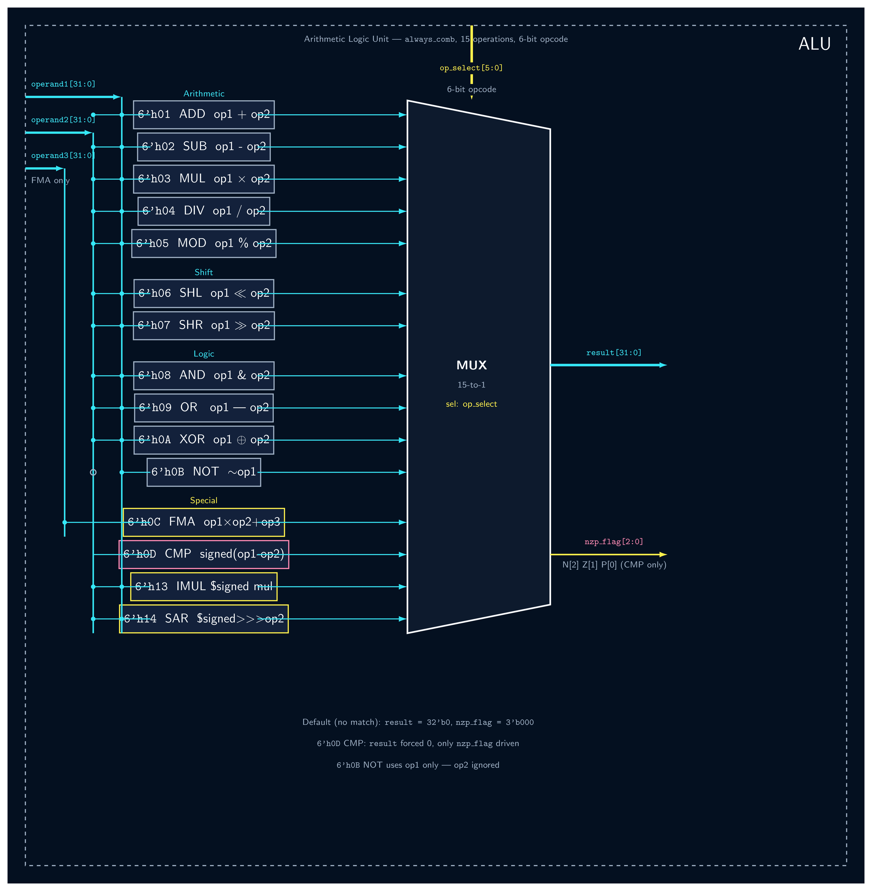
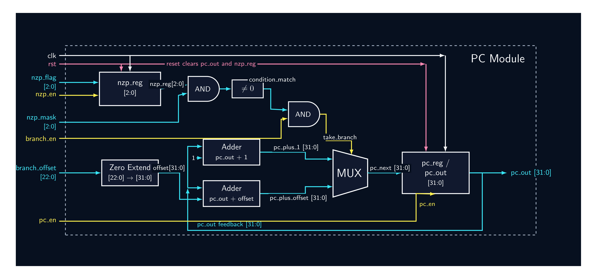
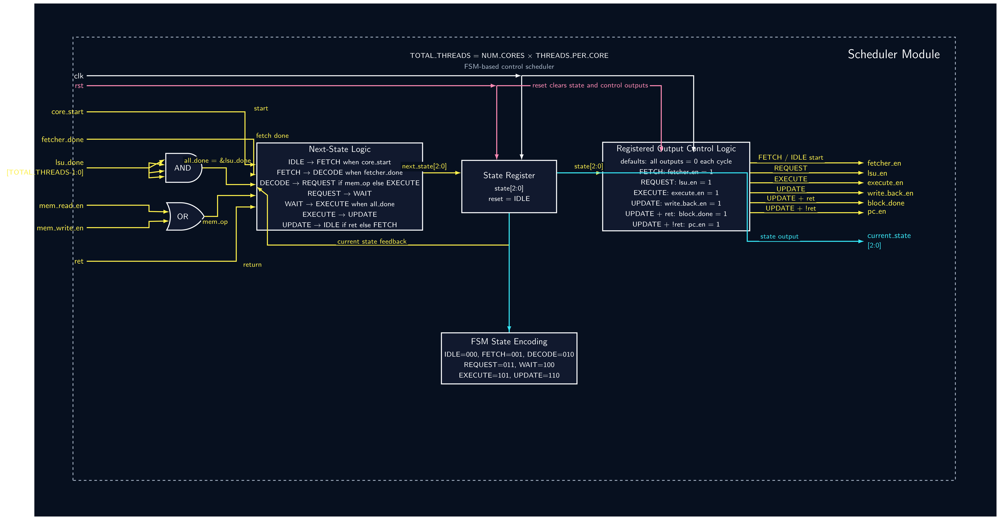
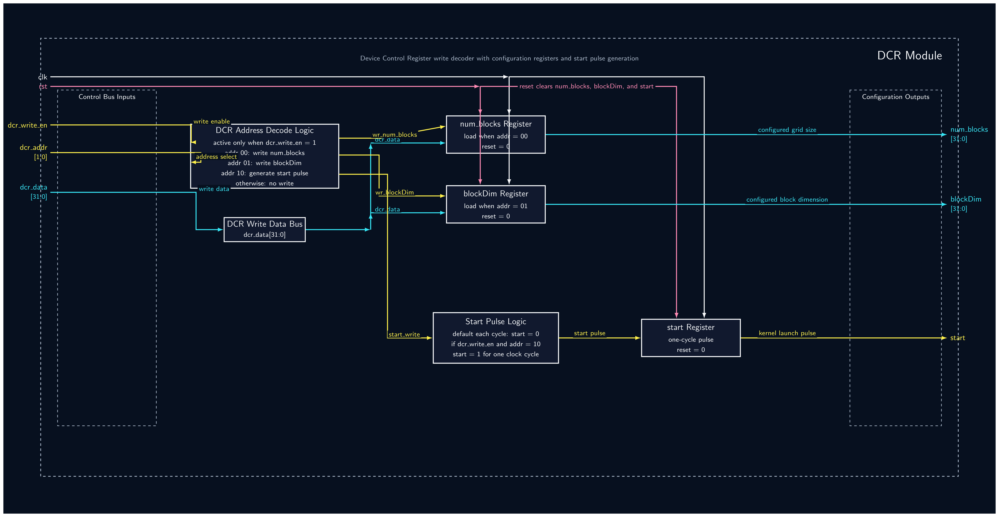

# 32-Bit Tiny GPU

A fully parameterized 32-bit GPU architecture implemented in SystemVerilog, built from scratch with a custom ISA, AXEL C assembler, cocotb-based verification, and an end-to-end neural network training and inference pipeline running on the simulated hardware. Synthesized and flashed to a Sipeed Tang Nano 20K FPGA.

---

## What This Is

This project implements a complete GPU stack entirely from scratch:

- Custom 32-bit ISA (21 instructions, 4 formats)
- SystemVerilog RTL with 12 modules, fully parameterized
- AXEL C assembler library that emits `.hex` kernels
- cocotb/Icarus Verilog simulation and verification suite
- A 4×4 linear layer neural network that trains on the GPU and runs inference
- Synthesized FPGA build targeting Sipeed Tang Nano 20K (GW2AR-18C QN88)

The GPU trains a matrix multiplication kernel over 20 epochs in Q8 fixed-point arithmetic, converges to within 2.5% of the target, and runs inference with a single `make infer`.

---

## Architecture Overview


**N** = NUM_CORES (default: 4)  
**T** = THREADS_PER_CORE (default: 4)  
**Total threads** = N × T (default: 16)

---

## Instruction Set Architecture (ISA)

32-bit fixed-width instructions. 6-bit opcode field. Four instruction formats:



### Opcode Table

| Opcode | Hex  | Instruction | Type | Description                              |
|--------|------|-------------|------|------------------------------------------|
| 000000 | 0x00 | NOP         | N    | No operation                             |
| 000001 | 0x01 | ADD         | R    | Rd = Rs1 + Rs2                           |
| 000010 | 0x02 | SUB         | R    | Rd = Rs1 − Rs2                           |
| 000011 | 0x03 | MUL         | R    | Rd = Rs1 × Rs2 (unsigned)                |
| 000100 | 0x04 | DIV         | R    | Rd = Rs1 / Rs2                           |
| 000101 | 0x05 | MOD         | R    | Rd = Rs1 % Rs2                           |
| 000110 | 0x06 | SHL         | R    | Rd = Rs1 << Rs2                          |
| 000111 | 0x07 | SHR         | R    | Rd = Rs1 >> Rs2 (logical)                |
| 001000 | 0x08 | AND         | R    | Rd = Rs1 & Rs2                           |
| 001001 | 0x09 | OR          | R    | Rd = Rs1 \| Rs2                          |
| 001010 | 0x0A | XOR         | R    | Rd = Rs1 ^ Rs2                           |
| 001011 | 0x0B | NOT         | R    | Rd = ~Rs1                                |
| 001100 | 0x0C | FMA         | R    | Rd = (Rs1 × Rs2) + Rs3                   |
| 001101 | 0x0D | CMP         | R    | Set NZP flags from Rs1 − Rs2             |
| 001110 | 0x0E | BRnzp       | B    | Branch if NZP condition met              |
| 001111 | 0x0F | LDR         | I    | Rd = Memory[Rs + imm]                    |
| 010000 | 0x10 | STR         | I    | Memory[Rs + imm] = Rd                    |
| 010001 | 0x11 | CONST       | I    | Rd = zero_extend(imm)                    |
| 010010 | 0x12 | RET         | N    | End thread block execution               |
| 010011 | 0x13 | IMUL        | R    | Rd = $signed(Rs1) × $signed(Rs2)         |
| 010100 | 0x14 | SAR         | R    | Rd = $signed(Rs1) >>> Rs2 (arithmetic)   |

IMUL and SAR were added to support Q8 fixed-point gradient computation. SHR fills with zeros, which corrupts the sign of negative gradients; SAR preserves it.

---

## Register File

32 registers, 32-bit wide each.

| Register  | Purpose    | Description                                         |
|-----------|-----------|-----------------------------------------------------|
| R0        | Hardwired  | Always reads as 0; writes ignored                  |
| R1–R28    | General    | General purpose computation registers              |
| R29       | threadIdx  | Read-only; hardware-injected thread index in block |
| R30       | blockIdx   | Read-only; hardware-injected block index in grid   |
| R31       | blockDim   | Read-only; hardware-injected block dimension       |

---

## Module Breakdown

### 1. Register File (`register_file.sv`)


32×32-bit storage. Synchronous write with reset (clears R1–R28). Asynchronous triple read (supports R-type and FMA). R0 hardwired to zero; R29/R30/R31 hardware injected.

### 2. ALU (`alu.sv`)


Pure combinational logic. Implements 15 arithmetic and logic operations: ADD, SUB, MUL (unsigned), DIV, MOD, SHL, SHR (logical), AND, OR, XOR, NOT, FMA (3-operand multiply-accumulate), CMP, IMUL (signed multiply), and SAR (arithmetic right shift). Control instructions (NOP, BRnzp, LDR, STR, CONST, RET) are handled by other modules. Outputs 32-bit result and 3-bit NZP flag. NZP encoding: N=100 (negative), Z=010 (zero), P=001 (positive).

### 3. Program Counter (`pc.sv`)


Per-thread instruction address register. Handles branch evaluation using NZP register. NZP register updated only on CMP via `nzp_en`. Uses independent `if` blocks for `nzp_en` and `pc_en` — critical for correct CMP+BRnzp sequencing.

### 4. Decoder (`decoder.sv`)


Pure combinational instruction decode. Extracts all fields from the 32-bit instruction word. Generates control signals: `write_back_en`, `mem_read_en`, `mem_write_en`, `branch_en`, `nzp_en`, `ret`.

### 5. Fetcher (`fetcher.sv`)


2-state FSM (IDLE → WAITING). Valid/ready handshake with program memory. One fetcher per core, shared across all threads (SIMD fetch from thread 0's PC).

### 6. LSU — Load Store Unit (`lsu.sv`)


2-state FSM (IDLE → WAITING). Handles LDR and STR with valid/ready handshake. `read_write_switch` signals memory read vs write direction. `is_read` explicitly cleared in the write path to prevent stale state. One LSU per thread.

### 7. Memory Controller (`mem_controller.sv`)


Parameterized pass-through (NUM_CORES × THREADS_PER_CORE channels). Direct 1:1 mapping between threads and memory channels. Pure combinational. Round-robin arbitration planned. Note: this module is tested standalone but is not instantiated in the top-level GPU — the top-level wires core data memory ports directly to memory, making the pass-through implicit.

### 8. Scheduler (`scheduler.sv`)


7-state FSM controlling the core pipeline. Broadcasts enable signals to all threads simultaneously (SIMD). Waits for all LSUs via AND-reduction of `lsu_done`. Outputs `pc_en` on the UPDATE→FETCH transition to advance the program counter.

```
IDLE    (000) — Wait for core_start
FETCH   (001) — Enable fetcher, wait for done
DECODE  (010) — Route to EXECUTE or REQUEST based on instruction type
REQUEST (011) — Enable LSUs for memory operations
WAIT    (100) — Wait until all LSUs complete
EXECUTE (101) — Enable ALUs for computation
UPDATE  (110) — Write back results, assert pc_en, check RET
```

### 9. Core (`core.sv`)


Instantiates 1 Scheduler, 1 Fetcher, 1 Decoder, and THREADS_PER_CORE instances each of ALU, LSU, and Register File. One shared PC instance is used across all threads (SIMD — all threads execute the same instruction; branch decision uses thread 0's NZP flag as representative). Write-back mux selects: LSU read data for LDR, zero-extended immediate for CONST, ALU result otherwise. STR address computed as `Rs + sign_extend(imm)`, and STR data reads via r_addr3 using Rd.

### 10. Dispatcher (`dispatcher.sv`)


Assigns thread blocks to available cores. One block assigned per core per cycle. Tracks active blocks with a signed delta accumulator using blocking assignments (required to prevent NBA race conditions in always_ff). Asserts `kernel_done` when all blocks processed. Uses packed 2D `blockIdx_out[NUM_CORES-1:0][31:0]` for Icarus compatibility.

### 11. DCR — Device Control Register (`dcr.sv`)


Host-facing configuration interface. Address 0x00: `num_blocks`. Address 0x01: `block_dim`. Address 0x02: `start` pulse (single cycle).

### 12. Top-Level GPU (`top_level_gpu.sv`)


Wires DCR → Dispatcher → Cores → Memory. Parameterized: change NUM_CORES and THREADS_PER_CORE to scale. Uses intermediate wires in generate loop for Icarus VPI unpacked array compatibility.

---

## Parameters

| Parameter         | Default | Description                         |
|------------------|---------|-------------------------------------|
| NUM_CORES         | 4       | Number of parallel cores            |
| THREADS_PER_CORE  | 4       | Threads per core (SIMD width)       |
| TOTAL_THREADS     | 16      | NUM_CORES × THREADS_PER_CORE        |

To scale to 4 cores × 16 threads each:

```systemverilog
gpu #(
    .NUM_CORES(4),
    .THREADS_PER_CORE(16)
) gpu_inst ( ... );
```

---

## AXEL Assembler


AXEL is a C library that emits `.hex` kernel files for the GPU. It provides two layers: `gpu_asm` (low-level `emit_*` functions) and `axel` (higher-level kernel API with register name aliases).

### Build

```bash
cd assembler
make phase4    # compiles and emits builds/phase4_forward.hex
make phase5    # compiles and emits builds/phase5_weight_update.hex
make           # builds all phases (phase1–5)
make test_add  # low-level gpu_asm API smoke test (4 instructions)
make test_axel # simple vector addition kernel demo (threadIdx + blockIdx)
```

### Register aliases

```c
R0–R28        // general purpose
THREAD_IDX    // R29 — hardware-injected thread index
BLOCK_IDX     // R30 — hardware-injected block index
BLOCK_DIM     // R31 — hardware-injected block dimension
```

### Example kernel

```c
AxelGPU gpu;
axel_init(&gpu, 1, 4);

axel_ldr(&gpu, R1, THREAD_IDX, 0);   // R1 = mem[threadIdx]
axel_add(&gpu, R2, R1, R1);           // R2 = 2 * R1
axel_str(&gpu, R2, THREAD_IDX, 4);   // mem[threadIdx + 4] = R2
axel_ret(&gpu);

axel_compile(&gpu, "output.hex");
```

---

## Neural Network — End-to-End Training and Inference

The GPU trains a 4×4 linear layer with ReLU activation in Q8 fixed-point arithmetic using gradient descent.

### Q8 Fixed-Point Encoding

All values are stored as integers where `real_value = stored_int / 256`.

| Real value | Q8 raw |
|-----------|--------|
| 1.0       | 256    |
| 2.0       | 512    |
| −0.5      | 0xFFFFFF80 |

Q8 multiply produces Q16, which is scaled down by SAR >>8 back to Q8. The gradient step combines Q8 scale-down and learning rate into a single SAR >>12 (lr = 1/16 in Q8 space).

### Memory Layout

| Address   | Contents                        |
|-----------|---------------------------------|
| 0–15      | W[4][4] — weights (Q8), W[i][j] at addr i×4+j |
| 16–19     | x[4] — input vector (Q8)        |
| 20–23     | y[4] — forward pass output (Q8) |
| 24–27     | t[4] — target vector (Q8)       |

### Kernel Phases

| Phase | File                     | Instructions | What it does                         |
|-------|--------------------------|-------------|--------------------------------------|
| 1     | `phase1_ldr_test.c`      | 4           | LDR/STR end-to-end smoke test        |
| 2     | `phase2_matmul.c`        | 19          | 4×4 matrix-vector multiply           |
| 3     | `phase3_relu.c`          | 8           | Branchless ReLU via bit masking      |
| 4     | `phase4_forward.c`       | 26          | Linear layer + ReLU in Q8            |
| 5     | `phase5_weight_update.c` | 36          | Gradient descent weight update in Q8 |

### Training Results

```
x (real) = [1.0, 2.0, 3.0, 4.0]
t (real) = [2.0, 4.0, 6.0, 8.0]  (target: W ≈ 2×I)

Epoch  1 | y=[1.0, 1.99, 3.0, 3.99] | err=[-1.0, -2.0, -3.0, -4.0]
Epoch 10 | y=[1.76, 3.55, 5.34, 7.14] | err=[-0.24, -0.45, -0.66, -0.86]
Epoch 20 | y=[1.95, 3.94, 5.94, 7.94] | err=[-0.05, -0.06, -0.06, -0.06]

Final W diagonal ≈ [1.06, 1.14, 1.29, 1.50]
```

Residual ~0.05 error is the Q8 quantization floor (1/256 ≈ 0.004 per gradient step). The network converges and stays there.

### Inference

```bash
cd Src/Top_level_GPU
make infer
```

Output:

```
=============================================
  Input  (Q8 raw) : [256, 512, 768, 1024]
  Input  (real)   : [1.0, 2.0, 3.0, 4.0]
=============================================
  Output (Q8 raw) : [499, 1010, 1523, 2035]
  Output (real)   : [1.9492, 3.9453, 5.9492, 7.9492]
=============================================
```

Trained weights persist in `assembler/builds/weights.json` between runs. The training loop loads them automatically on next `make`. Note: `weights.json` is gitignored and must be regenerated by running `make` in `Src/Top_level_GPU/` on a fresh clone.

---

## FPGA — Sipeed Tang Nano 20K

The GPU has been synthesized and flashed to a Sipeed Tang Nano 20K (GW2AR-18C QN88, 20K LUTs).

### FPGA Configuration

The FPGA build uses a reduced configuration for area reasons:

| Parameter         | Simulation | FPGA        |
|------------------|------------|-------------|
| NUM_CORES         | 4          | 1           |
| THREADS_PER_CORE  | 4          | 1           |
| num_blocks        | 1          | 4           |
| Execution model   | Parallel   | Sequential  |

With a single thread, R29 returns `blockIdx` when `blockDim == 1` (patched in `gpu_combined.v`), so each of the 4 sequential blocks computes one output neuron: `y[blockIdx]`. The result is numerically identical to the 4×4 simulation.

### FPGA-Specific Modifications (`gpu_combined.v`)

The `fpga/gpu_combined.v` file differs from the original `.sv` sources in the following ways:

- **Shared PC**: A single `pc` instance replaces the per-thread generate loop. All threads are SIMD and share one program counter; branch decision uses `nzp_result[0]` as representative.
- **R29 patch**: `registers.sv` read ports return `blockIdx` when `blockDim == 1`, enabling single-thread blocks to use `blockIdx` as their thread index.
- **`thread_keep_alive` port**: An XOR reduction of all thread `write_data` signals, added as a primary output to prevent synthesis tools from sweeping thread logic as dead code.
- **`(* syn_keep=1 *)`**: Applied to per-thread signal arrays to prevent incorrect dead logic elimination by Gowin synthesizer.
- **`(* syn_dont_touch = 1 *)`**: Applied at module level on `alu` and `registers` to prevent the synthesizer from merging or eliminating those instances.
- **`$dumpfile`/`$dumpvars` removed**: Simulation-only; breaks synthesis.

### Pin Assignments (Tang Nano 20K)

| Signal    | Pin | Notes                              |
|-----------|-----|------------------------------------|
| clk       | 4   | 27 MHz onboard oscillator (LVCMOS33) |
| led[0]    | 15  | kernel_done indicator (active-LOW) |
| led[1]    | 16  | Rolling heartbeat (active-LOW)     |
| led[2]    | 17  | Rolling heartbeat (active-LOW)     |
| led[3]    | 18  | Rolling heartbeat (active-LOW)     |
| led[4]    | 19  | Rolling heartbeat (active-LOW)     |
| led[5]    | 20  | Rolling heartbeat (active-LOW)     |
| uart_tx   | 69  | 115200 8N1 → BL616 USB-UART bridge |

### UART Output

After flashing, open the higher-numbered COM port at 115200 baud. Output:

```
GPU DONE
T:XXXXXXXX   (clk_slow cycles to kernel_done; 1 cycle = 296 ns at 3.375 MHz)
Y: YYYYYYYY YYYYYYYY YYYYYYYY YYYYYYYY  (Q8 hex, divide by 256 for real value)
```

### Toolchain

```
WSL (Ubuntu)               Windows
────────────────────────   ──────────────────────────
sv2v → gpu_combined.v      Gowin EDA Education Edition
iverilog + cocotb → test   Zadig (WinUSB driver, one-time)
```

Gowin EDA project settings: Device = GW2AR-18C QN88, Verilog Language = SystemVerilog 2017.

---

## Project Structure

```
32-bit-Tiny-GPU/
├── README.md
├── Makefile
├── .gitignore
├── make_leaf_schematic.sh             ← generates SVG schematics for each module
├── .github/
│   └── workflows/
│       └── rtl-tests.yml              ← CI/CD: runs make test on push/PR to main
├── assembler/
│   ├── Makefile
│   ├── include/
│   │   ├── axel.h
│   │   └── gpu_asm.h
│   ├── src/
│   │   ├── axel.c
│   │   └── gpu_asm.c
│   ├── examples/
│   │   ├── phase1_ldr_test.c
│   │   ├── phase2_matmul.c
│   │   ├── phase3_relu.c
│   │   ├── phase4_forward.c
│   │   ├── phase5_weight_update.c
│   │   ├── test_add.c             ← low-level gpu_asm API smoke test
│   │   └── test_axel.c            ← Axel API vector addition demo
│   └── builds/
│       ├── phase4_forward.hex
│       ├── phase5_weight_update.hex
│       └── weights.json              ← gitignored; regenerated by make
├── fpga/
│   ├── gpu_combined.v                ← sv2v output + FPGA modifications
│   ├── gpu_fpga_top.sv               ← FPGA wrapper (BRAM, DCR sequencer, UART)
│   ├── prog_mem.hex                  ← phase4_forward kernel (BRAM init)
│   ├── data_mem.hex                  ← trained weights + x/t vectors (BRAM init)
│   └── constraints/
│       └── gpu_top.cst               ← pin assignments for Tang Nano 20K
├── schematics/                        ← SVG schematics for each RTL module
├── assets/                            ← documentation images and PDFs
└── Src/
    ├── alu/
    ├── registers/
    ├── pc/
    ├── decoder/
    ├── fetcher/
    ├── lsu/
    ├── memory_controller/
    ├── scheduler/
    ├── core/
    ├── dispatcher/
    ├── device_control_register/
    └── Top_level_GPU/
        ├── top_level_gpu.sv
        ├── test_top_level_gpu.py
        ├── inference.py
        └── Makefile
```

---

## CI/CD

The repository runs automated RTL tests on every push and pull request to `main` via GitHub Actions (`.github/workflows/rtl-tests.yml`).

**Pipeline steps:**
1. Install Icarus Verilog, Make, GCC
2. Install Python 3.11 + cocotb
3. Run `make test` (full assembler build + all 40 cocotb tests)

---

## Prerequisites

- [Icarus Verilog](https://steveicarus.github.io/iverilog/) v12.0+
- Python 3.10+
- [cocotb](https://www.cocotb.org/) v2.0+
- GCC (for assembler)
- GTKWave (optional, for waveform viewing)
- [sv2v](https://github.com/zachjs/sv2v) (for FPGA synthesis)
- Gowin EDA Education Edition (for Tang Nano 20K synthesis and flashing)
- [yosys](https://github.com/YosysHQ/yosys) + [netlistsvg](https://github.com/nturley/netlistsvg) (optional, for `make_leaf_schematic.sh` SVG schematic generation)

### Install cocotb

```bash
python3 -m venv cocotb-env
source cocotb-env/bin/activate
pip install cocotb
```

---

## Running Tests

To run all tests from the repository root (builds assembler first, then runs all module tests):

```bash
source ~/cocotb-env/bin/activate
make test
```

To run tests for a specific module:

```bash
source ~/cocotb-env/bin/activate
cd Src/<module_name>
make
```

To run inference on trained weights:

```bash
make infer
```

### Test Results

| Module              | Tests | Status  |
|---------------------|-------|---------|
| Register File       | 4     | ✅ PASS |
| ALU                 | 6     | ✅ PASS |
| Program Counter     | 5     | ✅ PASS |
| Decoder             | 4     | ✅ PASS |
| Fetcher             | 3     | ✅ PASS |
| LSU                 | 3     | ✅ PASS |
| Memory Controller   | 3     | ✅ PASS |
| Scheduler           | 3     | ✅ PASS |
| Core                | 1     | ✅ PASS |
| Dispatcher          | 3     | ✅ PASS |
| DCR                 | 3     | ✅ PASS |
| Top-Level GPU       | 1     | ✅ PASS |

---

## Design Decisions

**Why separate NZP register in the PC module?**
The NZP flag is only consumed by BRnzp for PC updates. Keeping it co-located with the PC avoids routing flag state across module boundaries. Independent `if` blocks (not `else if`) in pc.sv ensure NZP can be written and PC can advance in the same cycle.

**Why 1:1 memory controller mapping?**
Simplicity for the initial implementation. The memory controller is designed for round-robin arbitration as a future upgrade — `clk` and `rst` are already stubbed out with comments.

**Why `write_back_en_sched` vs `write_back_en_dec`?**
The decoder's `write_back_en` indicates whether the instruction type requires a writeback. The scheduler's version is the actual enable signal gated by pipeline timing, allowing the scheduler to control writeback independently of instruction type.

**Why blocking assignments for `assigned` and `delta` in the dispatcher?**
These are loop-local accumulators within a single `always_ff` evaluation. Blocking assignments ensure they take effect immediately within the loop iteration, preventing NBA race conditions when assigning multiple cores in one cycle.

**Why IMUL instead of MUL for gradient computation?**
MUL treats operands as unsigned. Gradient errors are signed Q8 values — a negative error like `−0.25` (0xFFFFFFC0 in two's complement) would be interpreted as a large positive number by MUL, giving completely wrong weight updates. IMUL uses `$signed` casting on both operands.

**Why SAR instead of SHR?**
SHR fills vacated bits with 0. On a negative product (negative gradient), SHR would produce a large positive number instead of a small negative one. SAR sign-extends, preserving the sign across the scale-down.

**Why branchless ReLU?**
The GPU is SIMD — all threads in a core execute the same instruction. If threads branch differently (some positive, some negative), only thread 0's outcome drives the PC, corrupting all other threads. The branchless bit-mask approach computes `max(0, x)` arithmetically, with no branch divergence.

**Why a shared PC for the FPGA build?**
With THREADS_PER_CORE=1, there is no parallelism benefit from per-thread PCs. Synthesis tools treated the three non-thread-0 PCs as dead logic and swept them, corrupting addresses. A single shared PC with `nzp_result[0]` as branch input is architecturally correct for SIMD and eliminates the sweep problem.

---

## Known Limitations

- Icarus Verilog does not support unpacked array part-selects — intermediate wires used as workaround in the top-level generate block
- Memory controller is a pass-through with no arbitration — round-robin planned
- Fetcher is shared per core and uses thread 0's PC only (SIMD intentional; multi-PC fetch not supported)
- No hazard detection or pipeline stalling between back-to-back instructions
- Decoder generates ~32 "constant selects in always_*" warnings from Icarus (cosmetic — simulation correct; fix: move static field assignments to `assign` statements outside `always_comb`)
- FPGA build uses NUM_CORES=1, THREADS_PER_CORE=1 — runs 4 blocks sequentially, not in parallel

---

## Future Work

- Round-robin arbitration in Memory Controller
- Decoder warning fix (move static field decodes to `assign`)
- Higher Q-scale (Q10 = 1024 base) for ~0.001 precision floor vs current ~0.004
- Python AXEL runtime: write kernels in clean Python syntax, emit `.hex` directly
- Scale FPGA build to NUM_CORES=4, THREADS_PER_CORE=4 (full parallel configuration)
- UVM-based verification environment

---

## Author

**Austin Antony**  
B.Tech Applied Electronics and Instrumentation Engineering  
Rajagiri School of Engineering and Technology (2023–2027)  
CTO & Co-founder, Virtusco