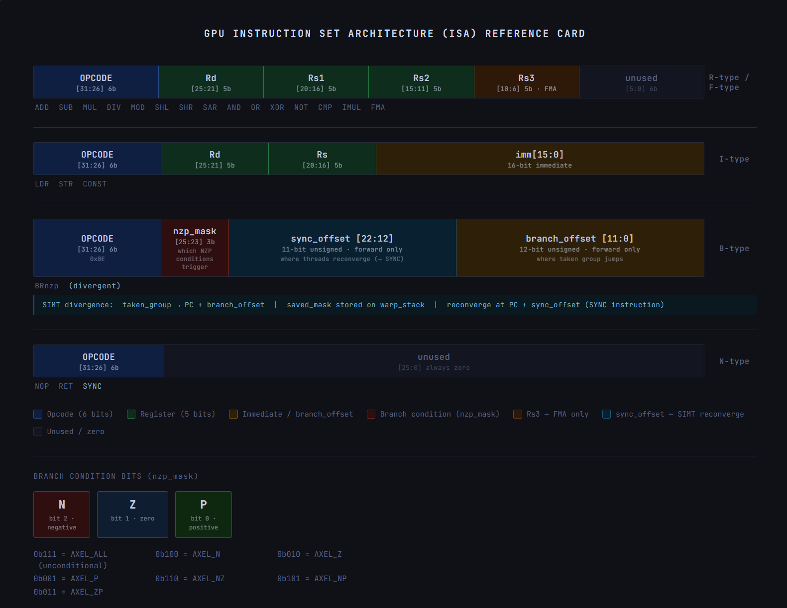
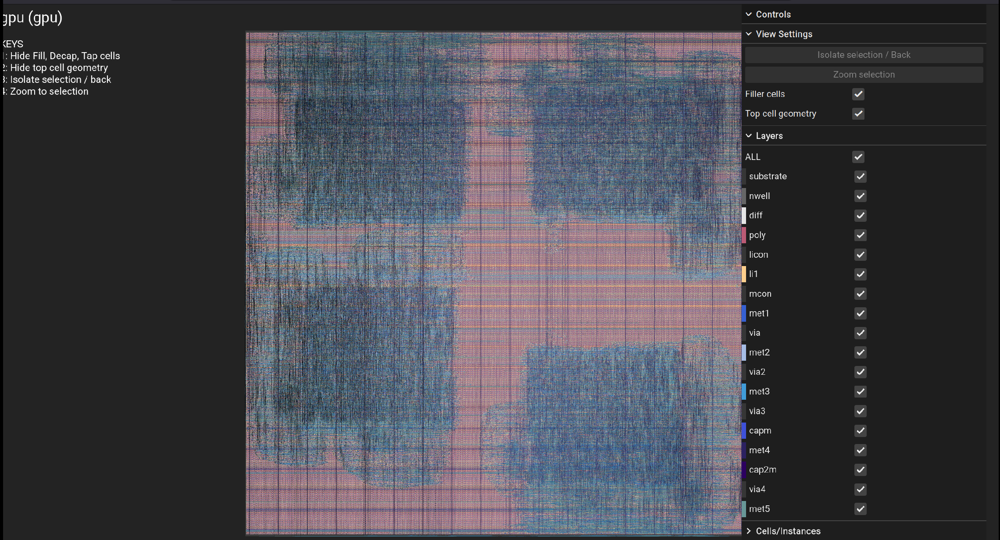

# 32-Bit Tiny GPU

A custom 32-bit SIMT GPU built from scratch in SystemVerilog.

This project includes a custom ISA, AXEL C assembler, `axelcc` C-subset compiler, cocotb verification suite, SIMT branch divergence with warp-stack reconvergence, a round-robin memory arbiter, Q8 fixed-point neural-network workloads, an MMIO matmul accelerator, FPGA targeting for the Sipeed Tang Nano 20K, and a full RTL-to-GDSII run on SkyWater Sky130A via OpenLane 2.

---

## Status

```text
Full regression:        323/323 tests passing (`make test` from repo root)
Top-level GPU suite:    28/28 tests passing
SIMT ReLU test:         PASSING
DOT4 kernel test:       PASSING
Q8 MLP workloads:       PASSING
Q8 matvec/matmul:       PASSING
Phase 21 accelerator:   PASSING
axelcc RTL tests:       9/9 PASSING (relu, loopsum, fmatest, ifelse x2,
                         ltcheck x2, matmultest, dot4test)
Execution trace:        cycle-accurate CSV logger integrated
Kernel cycle counter:   hardware 32-bit counter on kernel_cycles port
PyAXEL runtime:         cocotb subprocess backend, smoke test passing
FPGA target:            Tang Nano 20K
ASIC flow:              Sky130A GDS, 0 DRC violations, LVS passed
Post-route STA:         32.9 MHz (TT), 18.6 MHz (SS)
```

Latest verified regression summary:

```text
ALU:                 64/64 PASS
Registers:           21/21 PASS
PC:                  23/23 PASS
Decoder:             23/23 PASS
Fetcher:             21/21 PASS
LSU:                 29/29 PASS
Memory Controller:   20/20 PASS
Scheduler:           25/25 PASS
Core:                14/14 PASS
Dispatcher:          19/19 PASS
DCR:                 19/19 PASS
Warp Stack:          17/17 PASS
Top-Level GPU:       28/28 PASS

Total:               323/323 PASS
```

`make test` from the repo root now always rebuilds `axelcc` from source and
recompiles every example kernel before running any RTL test (see
`axelcc/README.md`), so this number reflects a fully fresh build every time,
not stale pre-copied `.hex` artifacts.

Key verified top-level workloads:

```text
Phase 6  SIMT ReLU
Phase 7  DOT4 kernel
Phase 8  Q8 MLP 4->4
Phase 9  register-base LDR
Phase 10 Q8 MLP 4->8
Phase 11 Q8 MLP 8->4
Phase 12 Q6/SAR6 MLP
Phase 13 small digit hidden layer
Phase 14 small digit output layer
Phase 15 true 64->16 hidden layer
Phase 16 chained 64->16->10 classifier
Phase 17 Q8 4x4 matvec
Phase 18 Q8 4x4 matmul
Phase 19 Q8 4x8 matmul
Phase 20 Q8 4x16 tiled matmul
Phase 21 MMIO matmul accelerator
axelcc compiler: relu, loopsum, fmatest, if/else (both branches),
  ltcheck (both branches), mmio_matmul, dot4
```

---

## Key Verified Regressions

### Phase 6 SIMT ReLU

```text
Input:
  mem[0] =  5
  mem[1] = -3
  mem[2] =  8
  mem[3] = -1

Output:
  mem[4] = 5
  mem[5] = 0
  mem[6] = 8
  mem[7] = 0
```

This test exercises:

```text
LDR writeback
CMP
BRnzp
stored NZP flags
active-mask gating
warp-stack push/pop
SYNC reconvergence
STR
kernel completion
```

### Phase 7 DOT4 Kernel

```text
vec A = [1, 2, 3, 4]
vec B = [1, 2, 3, 4]

golden result   = 30
hardware result = 30
```

### Phase 8 Q8 MLP 4->4

```text
y[0] = 20
y[1] = 48
y[2] = 25
y[3] = 8
```

### Phase 15 True 64->16 Hidden Layer

```text
h = [7, 0, 0, 5, 0, 0, 2, 0, 0, 0, 0, 2, 0, 0, 3, 0]
```

### Phase 16 Chained 64->16->10 Classifier

```text
scores = [2, 0, 0, 0, 0, 0, 0, 0, 0, 0]
argmax = class 0
```

### Phase 20 Q8 4x16 Tiled Matmul

```text
C[0] = [16, 32,  8,  8]
C[1] = [32, 64, 16, 16]
C[2] = [28, 56, 16, 12]
C[3] = [40, 80, 16, 24]

kernel_cycles = 342
```

### Phase 21 MMIO Matmul Accelerator

```text
C[0] = [16, 32,  8,  8]
C[1] = [32, 64, 16, 16]
C[2] = [28, 56, 16, 12]
C[3] = [40, 80, 16, 24]

Phase 21 cycles:   605
Phase 20 baseline: 342
Delta:             +263
```

The Phase 21 accelerator is currently sequential, so it is slower than the parallel DOT4 GPU kernel for this small matrix size. Its purpose is to verify top-level MMIO accelerator integration, runtime configuration latching, memory read/write behavior, completion tracking, and accelerator-aware `kernel_done` gating.

### axelcc Compiler

```text
input  = [5, -3, 8, -1]
output = [5,  0, 8,  0]

kernel_cycles = 138
```

The compiler-generated `.hex` executes correctly on the full `Top_level_GPU` RTL testbench.

Beyond ReLU, `axelcc` now compiles and hardware-verifies `if`/`else` (both
branches), `for` loops, `dot4()`, `fma()`, and `mmio_matmul()` — 9 RTL
tests total. Two real compiler bugs were found and fixed during that
verification work: `STMT_IF` codegen had no instruction to skip the
`then` body on the not-taken path (so an `else` branch's write was always
overwritten by the `then` body's write), and `EXPR_DOT4` was silently
emitting the scalar `FMA` opcode instead of the packed `DOT4` opcode. See
`axelcc/README.md` for the full writeup.

---

## Architecture


Default simulation configuration:

```text
NUM_CORES         = 4
THREADS_PER_CORE = 4
TOTAL_THREADS    = 16
```

Top-level hierarchy:

```text
gpu
├── dcr
├── dispatcher
├── matmul_accelerator
└── core_gen[i]  (i = 0..3)
    └── core
        ├── fetcher
        ├── decoder
        ├── scheduler
        ├── warp_stack
        ├── mem_controller   (round-robin, 2-state FSM)
        └── thread_gen[j]    (j = 0..3)
            ├── registers
            ├── alu
            ├── lsu
            └── pc
```

Full architecture details: [`docs/architecture.md`](docs/architecture.md)

---

## Documentation

| Document                | Path                                                                   |
| ----------------------- | ---------------------------------------------------------------------- |
| Architecture            | [`docs/architecture.md`](docs/architecture.md)                         |
| ISA                     | [`docs/isa.md`](docs/isa.md)                                           |
| Memory map              | [`docs/memory_map.md`](docs/memory_map.md)                             |
| Debug log               | [`docs/debug_log.md`](docs/debug_log.md)                               |
| AI inference milestones | [`docs/ai_inference_milestones.md`](docs/ai_inference_milestones.md)   |
| AXEL assembler          | [`assembler/README.md`](assembler/README.md)                           |
| axelcc compiler         | [`axelcc/README.md`](axelcc/README.md)                                 |
| Matmul accelerator      | [`Src/matmul_accelerator/README.md`](Src/matmul_accelerator/README.md) |
| FPGA build              | [`fpga/README.md`](fpga/README.md)                                     |
| OpenLane / GDS          | [`gds/README.md`](gds/README.md)                                       |
| Post-route STA          | [`sta/`](sta/)                                                         |
| PyAXEL runtime          | [`pyaxel/README.md`](pyaxel/README.md)                                 |

---

## Module Documentation

| Module             | README                                                                           | RTL                                                                                            | Tests                                                                      |
| ------------------ | -------------------------------------------------------------------------------- | ---------------------------------------------------------------------------------------------- | -------------------------------------------------------------------------- |
| ALU                | [`Src/alu/README.md`](Src/alu/README.md)                                         | [`Src/alu/alu.sv`](Src/alu/alu.sv)                                                             | [`Src/alu/tests/`](Src/alu/tests/)                                         |
| Core               | [`Src/core/README.md`](Src/core/README.md)                                       | [`Src/core/core.sv`](Src/core/core.sv)                                                         | [`Src/core/tests/`](Src/core/tests/)                                       |
| Decoder            | [`Src/decoder/README.md`](Src/decoder/README.md)                                 | [`Src/decoder/decoder.sv`](Src/decoder/decoder.sv)                                             | [`Src/decoder/tests/`](Src/decoder/tests/)                                 |
| DCR                | [`Src/device_control_register/README.md`](Src/device_control_register/README.md) | [`Src/device_control_register/dcr.sv`](Src/device_control_register/dcr.sv)                     | [`Src/device_control_register/tests/`](Src/device_control_register/tests/) |
| Dispatcher         | [`Src/dispatcher/README.md`](Src/dispatcher/README.md)                           | [`Src/dispatcher/dispatcher.sv`](Src/dispatcher/dispatcher.sv)                                 | [`Src/dispatcher/tests/`](Src/dispatcher/tests/)                           |
| Fetcher            | [`Src/fetcher/README.md`](Src/fetcher/README.md)                                 | [`Src/fetcher/fetcher.sv`](Src/fetcher/fetcher.sv)                                             | [`Src/fetcher/tests/`](Src/fetcher/tests/)                                 |
| LSU                | [`Src/lsu/README.md`](Src/lsu/README.md)                                         | [`Src/lsu/lsu.sv`](Src/lsu/lsu.sv)                                                             | [`Src/lsu/tests/`](Src/lsu/tests/)                                         |
| Memory Controller  | [`Src/memory_controller/README.md`](Src/memory_controller/README.md)             | [`Src/memory_controller/mem_controller.sv`](Src/memory_controller/mem_controller.sv)           | [`Src/memory_controller/tests/`](Src/memory_controller/tests/)             |
| PC                 | [`Src/pc/README.md`](Src/pc/README.md)                                           | [`Src/pc/pc.sv`](Src/pc/pc.sv)                                                                 | [`Src/pc/tests/`](Src/pc/tests/)                                           |
| Registers          | [`Src/registers/README.md`](Src/registers/README.md)                             | [`Src/registers/register_file.sv`](Src/registers/register_file.sv)                             | [`Src/registers/tests/`](Src/registers/tests/)                             |
| Scheduler          | [`Src/scheduler/README.md`](Src/scheduler/README.md)                             | [`Src/scheduler/scheduler.sv`](Src/scheduler/scheduler.sv)                                     | [`Src/scheduler/tests/`](Src/scheduler/tests/)                             |
| Warp Stack         | [`Src/warp_stack/README.md`](Src/warp_stack/README.md)                           | [`Src/warp_stack/warp_stack.sv`](Src/warp_stack/warp_stack.sv)                                 | [`Src/warp_stack/tests/`](Src/warp_stack/tests/)                           |
| Matmul Accelerator | [`Src/matmul_accelerator/README.md`](Src/matmul_accelerator/README.md)           | [`Src/matmul_accelerator/matmul_accelerator.sv`](Src/matmul_accelerator/matmul_accelerator.sv) | [`Src/matmul_accelerator/tests/`](Src/matmul_accelerator/tests/)           |
| Top-Level GPU      | [`Src/Top_level_GPU/README.md`](Src/Top_level_GPU/README.md)                     | [`Src/Top_level_GPU/top_level_gpu.sv`](Src/Top_level_GPU/top_level_gpu.sv)                     | [`Src/Top_level_GPU/tests/`](Src/Top_level_GPU/tests/)                     |

---

## ISA Summary

The GPU uses 32-bit fixed-width instructions with a 6-bit opcode field.



Instruction formats:

```text
R-type   register/register ALU operations
I-type   load / store / constant immediate
B-type   BRnzp SIMT branch
N-type   NOP, RET, SYNC
```

Supported instructions:

```text
NOP, ADD, SUB, MUL, DIV, MOD, SHL, SHR,
AND, OR, XOR, NOT, FMA, CMP, BRnzp,
LDR, STR, CONST, RET, IMUL, SAR, SYNC,
DOT4
```

Instruction groups:

```text
Arithmetic:      ADD, SUB, MUL, IMUL, FMA
Logic:           AND, OR, XOR, NOT
Shift:           SHL, SHR, SAR
Control:         CMP, BRnzp, SYNC, RET, NOP
Memory:          LDR, STR
Immediate:       CONST
ML extension:    DOT4
```

Full ISA documentation: [`docs/isa.md`](docs/isa.md)

---

## SIMT Execution Model

Each thread lane has its own:

```text
register file    independent architectural state
ALU              per-thread arithmetic
LSU              per-thread memory access
PC               per-thread program counter
NZP flag         per-thread condition code
```

Each core shares:

```text
fetcher          single instruction fetch per cycle
decoder          shared decode result broadcast to all lanes
scheduler        active_mask gating, 10-state FSM
warp_stack       depth-4 divergence stack (sync_pc, saved_mask)
mem_controller   round-robin arbiter, 2-state FSM, request buffering
```

Divergence and reconvergence flow:

```text
CMP sets per-thread NZP
BRnzp evaluates taken_mask vs active_mask
divergence_detected triggers warp_stack push
taken group runs with taken_mask as active_mask
SYNC triggers warp_stack pop
saved_mask restored, threads reconverge
```

More detail:

* [`docs/architecture.md`](docs/architecture.md)
* [`Src/warp_stack/README.md`](Src/warp_stack/README.md)
* [`Src/scheduler/README.md`](Src/scheduler/README.md)

---

## Memory Controller

Each core contains a round-robin memory arbiter that serializes the 4 per-thread LSU requests into a single memory channel.

```text
THREADS_PER_CORE = 4 LSU ports in
1 memory channel out

2-state FSM:   IDLE -> WAIT -> IDLE
rr_ptr:        advances after each completed transaction
pending[]:     one-cycle request pulses buffered while busy
resp_data[]:   packed 2D output [THREADS_PER_CORE-1:0][31:0]
```

This means the top-level data memory interface is 4-wide, one port per core, not 16-wide, one port per thread. The wrapper only needs to model one BRAM per core. Thread-level arbitration happens inside each core.

Important memory behavior:

```text
LDR and STR are word-addressed
Each active lane may issue a request
Inactive lanes must not issue memory requests
The memory controller buffers one-cycle LSU pulses while busy
Round-robin arbitration prevents fixed-priority starvation
```

---

## MMIO Matmul Accelerator

Phase 21 adds a memory-mapped matrix multiplication accelerator integrated at the top-level GPU.

Path:

```text
Src/matmul_accelerator/
```

Main files:

```text
Src/matmul_accelerator/matmul_accelerator.sv
Src/matmul_accelerator/README.md
Src/matmul_accelerator/tests/
Src/Top_level_GPU/tests/test_phase21_accel_matmul.py
assembler/examples/phase21_accel_matmul.c
```

The accelerator is configured through MMIO registers for:

```text
A_BASE
B_BASE
C_BASE
M
N
K
SCALE
START
STATUS / DONE
```

Current verified workload:

```text
A:     4x16
B:     16x4
C:     4x4
scale: arithmetic shift right
```

Verified output:

```text
C[0] = [16, 32,  8,  8]
C[1] = [32, 64, 16, 16]
C[2] = [28, 56, 16, 12]
C[3] = [40, 80, 16, 24]
```

Cycle comparison:

```text
Phase 20 DOT4 GPU baseline: 342 cycles
Phase 21 accelerator:       605 cycles
Delta:                      +263 cycles
```

The current accelerator is sequential, so it is slower than the parallel DOT4 GPU kernel for this small 4x16 by 16x4 workload. This milestone verifies accelerator integration rather than performance.

The Phase 21 top-level fix also adds accelerator-aware completion gating:

```text
kernel_done = dispatcher_kernel_done && !accel_inflight
```

This prevents the GPU from reporting kernel completion while the accelerator is still writing output data.

Run accelerator tests:

```bash
cd Src/matmul_accelerator
make
```

Run top-level Phase 21 test:

```bash
cd Src/Top_level_GPU
make COCOTB_TEST_MODULES=tests.test_phase21_accel_matmul
```

Expected:

```text
Phase 21 PASSED: 16/16 elements correct
```

Full documentation: [`Src/matmul_accelerator/README.md`](Src/matmul_accelerator/README.md)

---

## AXEL Assembler

AXEL is a C-based assembler that emits `.hex` and `.axelbin` programs for the GPU.


Main files:

```text
assembler/include/axel.h
assembler/include/gpu_asm.h
assembler/src/axel.c
assembler/src/gpu_asm.c
assembler/examples/
assembler/tools/axelbin.py
```

Build all assembler examples:

```bash
cd assembler
make
```

Generated kernel artifacts are placed under:

```text
assembler/builds/hex/
assembler/builds/bin/
```

Example generated programs:

```text
phase6_simt_relu.hex
phase7_dot4_test.hex
phase8_mlp_inference.hex
phase17_q8_matvec_4x4.hex
phase18_q8_matmul_4x4.hex
phase19_q8_matmul_4x8.hex
phase20_q8_matmul_4x16.hex
phase21_accel_matmul.hex
```

Example kernel, SIMT ReLU:

```c
AxelGPU gpu;
axel_init(&gpu, 1, 4);              // 1 block, 4 threads

axel_ldr(&gpu, R1, THREAD_IDX, 0);  // load input
axel_cmp(&gpu, R0, R1);             // compare with 0
axel_brnzp(&gpu, NZP_N, skip);      // branch if negative
axel_str(&gpu, R1, THREAD_IDX, 4);  // store result

skip:
axel_const(&gpu, R1, 0);
axel_str(&gpu, R1, THREAD_IDX, 4);  // store 0
axel_sync(&gpu);
axel_ret(&gpu);

axel_compile(&gpu, "output.hex");
```

Full assembler documentation: [`assembler/README.md`](assembler/README.md)

---

## axelcc Compiler

`axelcc` is a small C-like compiler for the AXEL GPU.

Path:

```text
axelcc/
```

It compiles a restricted kernel-oriented C subset into AXEL GPU machine code and emits:

```text
.hex
.axelbin
```

Main files:

```text
axelcc/Makefile
axelcc/README.md
axelcc/examples/*.axelc     (relu, loopsum, fmatest, ifelse, ltcheck,
                              matmultest, dot4test, nestedif)
axelcc/src/
```

Compiler pipeline:

```text
lexer
parser
AST
semantic checks
simple register allocation
code generation
.hex writer
.axelbin writer
```

Current verified example:

```c
kernel void simt_relu() {
    int tid = threadIdx;
    int val = mem[tid];

    if (val > 0) {
        // val remains unchanged
    } else {
        val = 0;
    }

    mem[4 + tid] = val;
    return;
}
```

Build:

```bash
cd axelcc
make clean && make
```

Compile the example ReLU kernel (or use `make examples` to compile every
kernel straight into `test_binaries/` and copy into `assembler/builds/`,
see below):

```bash
./axelcc examples/relu.axelc
```

Generated local outputs (current directory, unless `-o` is passed):

```text
relu.hex
relu.axelbin
```

Run compiler-generated ReLU on full GPU RTL. `make examples` (in `axelcc/`)
rebuilds the compiler and recompiles every kernel, copying `.hex`/`.axelbin`
into `assembler/builds/` automatically -- no manual copy step:

```bash
cd ~/gpu-project/axelcc
make examples

cd ~/gpu-project/Src/Top_level_GPU
make COCOTB_TEST_MODULES=tests.test_axelcc_relu
```

Expected result:

```text
mem[4] = 5 PASS
mem[5] = 0 PASS
mem[6] = 8 PASS
mem[7] = 0 PASS
axelcc ReLU PASSED
```

Current language subset:

```text
kernel void
int variables
assignments
mem[...] load/store
if/else            (hardware-verified, both branches)
for (i = init; i < bound; i++)   (< only)
return
threadIdx
blockIdx
blockDim
dot4()              -> DOT4 opcode (0x16), hardware-verified
fma()                -> FMA opcode (0x0C), hardware-verified
mmio_matmul()        -> full accelerator launch+poll, hardware-verified
exp8()               reserved, not yet exercised by any test
```

Current limitations:

```text
one kernel per source file
no pointer support
no local arrays
no nested if (enforced by sema.c, by design)
no optimizer
simple register allocation
no full kernel parameter ABI in RTL flow yet
for loops only support a < condition
```

Full compiler documentation: [`axelcc/README.md`](axelcc/README.md)

---

## Memory Map

Neural-network workloads use fixed-point integer values.

For Q8:

```text
real_value = q8_value / 256
q8_value   = round(real_value * 256)
```

SIMT ReLU kernel layout:

| Address range | Contents                    |
| ------------- | --------------------------- |
| `0-3`         | Input values, signed        |
| `4-7`         | Output values, ReLU applied |

Basic MLP layout:

| Address range | Contents                   |
| ------------- | -------------------------- |
| `0-15`        | `W[4][4]` Q8 weight matrix |
| `16-19`       | `x[4]` Q8 input vector     |
| `20-23`       | `y[4]` Q8 output vector    |
| `24-27`       | `t[4]` Q8 target vector    |

Phase 17 matvec layout:

| Address range | Contents               |
| ------------- | ---------------------- |
| `0-3`         | Packed Q8 matrix rows  |
| `4`           | Packed Q8 input vector |
| `5-8`         | Output vector          |

Phase 18 / 19 / 20 matmul layout varies by workload size, but follows:

```text
A matrix input
B matrix input
C matrix output
```

Phase 21 accelerator test layout:

| Address range | Contents        |
| ------------- | --------------- |
| `0x000+`      | Matrix A        |
| `0x010+`      | Matrix B        |
| `0x020+`      | Matrix C output |

Full memory documentation: [`docs/memory_map.md`](docs/memory_map.md)

---

## Running Tests

Activate the cocotb environment:

```bash
source ~/cocotb-env/bin/activate
```

Run all tests from the repository root:

```bash
make test
```

Run one module test:

```bash
cd Src/<module_name>
make
```

Run top-level GPU tests:

```bash
cd Src/Top_level_GPU
make
```

Run only SIMT ReLU from the top-level test file:

```bash
cd Src/Top_level_GPU
make COCOTB_TEST_FILTER='test_simt_relu$'
```

Run only Phase 21 top-level accelerator test:

```bash
cd Src/Top_level_GPU
make COCOTB_TEST_MODULES=tests.test_phase21_accel_matmul
```

Run only axelcc ReLU RTL test:

```bash
cd Src/Top_level_GPU
make COCOTB_TEST_MODULES=tests.test_axelcc_relu
```

Run the full axelcc RTL suite:

```bash
cd Src/Top_level_GPU
make COCOTB_TEST_MODULES=tests.test_axelcc_relu,tests.test_axelcc_loopsum,tests.test_axelcc_fmatest,tests.test_axelcc_ifelse,tests.test_axelcc_ltcheck,tests.test_axelcc_matmultest,tests.test_axelcc_dot4test
```

Run matmul accelerator standalone tests:

```bash
cd Src/matmul_accelerator
make
```

Run inference:

```bash
cd Src/Top_level_GPU
make infer
```

---

## Test Coverage

| Module / Suite    |   Tests | Status           |
| ----------------- | ------: | ---------------- |
| ALU               |      64 | PASS             |
| Registers         |      21 | PASS             |
| PC                |      23 | PASS             |
| Decoder           |      23 | PASS             |
| Fetcher           |      21 | PASS             |
| LSU               |      29 | PASS             |
| Memory Controller |      20 | PASS             |
| Scheduler         |      25 | PASS             |
| Core              |      14 | PASS             |
| Dispatcher        |      19 | PASS             |
| DCR               |      19 | PASS             |
| Warp Stack        |      17 | PASS             |
| Top-Level GPU     |      28 | PASS             |
| **Total**         | **323** | **323/323 PASS** |

Top-level GPU suite includes:

```text
test_gpu_axel_program
test_simt_relu
test_dot4_kernel
test_pyaxel_runner
test_phase08_mlp
test_phase09_ldr (2 tests: single + broadcast)
test_phase10_mlp_8out
test_phase11_mlp_8in
test_phase12_mlp_q6
test_phase13_digit_hidden
test_phase14_digit_output
test_phase15_digit64_hidden
test_phase16_digit64_classifier
test_phase17_q8_matvec
test_phase18_q8_matmul
test_phase19_q8_matmul_4x8
test_phase20_q8_matmul_4x16
test_phase21_accel_matmul
test_axelcc_relu
test_axelcc_loopsum
test_axelcc_fmatest
test_axelcc_ifelse (2 tests: then + else branch)
test_axelcc_ltcheck (2 tests: true + false)
test_axelcc_matmultest
test_axelcc_dot4test
```

---

## FPGA Target

Target board:

```text
Sipeed Tang Nano 20K
GW2AR-18C QN88
Gowin EDA, SV2017 mode
```

The current FPGA build targets the full SIMT configuration:

| Parameter          | Value                 |
| ------------------ | --------------------- |
| `NUM_CORES`        | 4                     |
| `THREADS_PER_CORE` | 4                     |
| `num_blocks`       | 1                     |
| `blockDim`         | 4                     |
| Clock              | 3.375 MHz, 27 MHz / 8 |
| UART               | 115200 baud, pin 69   |

Each core gets one independent program BRAM and one independent data BRAM. The round-robin `mem_controller` inside each core handles thread arbitration before the request reaches the wrapper.

Expected UART output after flash:

```text
SIMT GPU
T:XXXXXXXX
R:00000005 00000000 00000008 00000000
```

Full FPGA documentation: [`fpga/README.md`](fpga/README.md)

---

## OpenLane / Sky130A GDS

The GPU has been taken through RTL-to-GDSII using OpenLane 2 and SkyWater Sky130A.



### SIMT GPU

| Metric                   | Value                                            |
| ------------------------ | ------------------------------------------------ |
| Process                  | SkyWater Sky130A, 130 nm                         |
| Standard cell library    | sky130_fd_sc_hd                                  |
| Die area                 | 7.97 mm², approximately 2.82 x 2.82 mm           |
| Core utilization         | 27.9%                                            |
| Total std cells          | 300,884                                          |
| LVS devices matched      | 188,812                                          |
| LVS nets matched         | 189,107                                          |
| Magic DRC violations     | **0**                                            |
| LVS result               | **Circuits match uniquely**                      |
| Achievable frequency, TT | **~32.9 MHz**, 25°C / 1.80V, post-route SDF STA  |
| Achievable frequency, SS | **~18.6 MHz**, 100°C / 1.60V, post-route SDF STA |
| Critical path            | Core datapath mux tree, approximately 31 ns      |
| Tool                     | OpenLane 2.3.10                                  |

### SIMD Baseline

| Metric               | Value                          |
| -------------------- | ------------------------------ |
| Standard cells       | 204,938                        |
| Chip area            | 1.977 mm²                      |
| Worst setup slack    | +8.01 ns, approximately 59 MHz |
| Magic DRC violations | 5                              |
| LVS result           | Passed                         |

Post-route STA scripts and logs: [`sta/`](sta/)

Full GDS documentation: [`gds/README.md`](gds/README.md)

---

## Important Design Rules

1. Keep packed memory response buses aligned across RTL and cocotb.
2. `resp_data` in `mem_controller.sv` must be packed 2D: `[THREADS_PER_CORE-1:0][31:0]`.
3. Register writeback must be gated by scheduler `write_back_en`, decoder `write_back_en`, and `active_mask`.
4. Inactive SIMT lanes must not issue LSU requests, write registers, or advance PC.
5. `BRnzp` uses stored NZP from the PC module, not raw ALU output from the current cycle.
6. The instruction latch in `core.sv`, from `instruction_raw` to `instruction`, is required for stable multicycle execution.
7. LSU request pulses are one cycle wide.
8. The memory controller buffers LSU request pulses in `pending[]` while busy.
9. Accelerator MMIO writes must not be treated as normal data-memory writes.
10. Accelerator runtime configuration must be latched on `START`, not read live while running.
11. Top-level `kernel_done` must wait for both dispatcher completion and accelerator completion.
12. Generated files such as `assembler/builds/`, `sim_build/`, `results.xml`, `axelcc/build/`, and `axelcc/test_binaries/` should not be committed.

Detailed debug history: [`docs/debug_log.md`](docs/debug_log.md)

---

## Project Structure

Clean high-level repository structure:

```text
32-bit-Tiny-GPU/
├── Makefile
├── README.md
├── Src
│   ├── Top_level_GPU
│   │   ├── Makefile
│   │   ├── README.md
│   │   ├── inference.py
│   │   ├── test_top_level_gpu.py
│   │   ├── tests
│   │   │   ├── __init__.py
│   │   │   ├── common.py
│   │   │   ├── memory_models.py
│   │   │   ├── test_axelcc_relu.py
│   │   │   ├── test_axelcc_loopsum.py
│   │   │   ├── test_axelcc_fmatest.py
│   │   │   ├── test_axelcc_ifelse.py
│   │   │   ├── test_axelcc_ltcheck.py
│   │   │   ├── test_axelcc_matmultest.py
│   │   │   ├── test_axelcc_dot4test.py
│   │   │   ├── test_phase08_mlp.py
│   │   │   ├── test_phase09_ldr.py
│   │   │   ├── test_phase10_mlp_8out.py
│   │   │   ├── test_phase11_mlp_8in.py
│   │   │   ├── test_phase12_mlp_q6.py
│   │   │   ├── test_phase13_digit_hidden.py
│   │   │   ├── test_phase14_digit_output.py
│   │   │   ├── test_phase15_digit64_hidden.py
│   │   │   ├── test_phase16_digit64_classifier.py
│   │   │   ├── test_phase17_q8_matvec.py
│   │   │   ├── test_phase18_q8_matmul.py
│   │   │   ├── test_phase19_q8_matmul_4x8.py
│   │   │   ├── test_phase20_q8_matmul_4x16.py
│   │   │   └── test_phase21_accel_matmul.py
│   │   ├── top_level_gpu.sv
│   │   └── trace_simt_relu.csv
│   ├── alu
│   │   ├── Makefile
│   │   ├── README.md
│   │   ├── alu.sv
│   │   ├── legacy
│   │   │   └── test_alu_old.py
│   │   └── tests
│   │       ├── __init__.py
│   │       ├── common.py
│   │       ├── test_alu_directed.py
│   │       └── test_alu_random.py
│   ├── core
│   │   ├── Makefile
│   │   ├── README.md
│   │   ├── core.sv
│   │   ├── legacy
│   │   │   └── test_core_old.py
│   │   └── tests
│   │       ├── __init__.py
│   │       ├── common.py
│   │       ├── test_core_directed.py
│   │       └── test_core_random.py
│   ├── decoder
│   │   ├── Makefile
│   │   ├── README.md
│   │   ├── decoder.sv
│   │   ├── legacy
│   │   │   └── test_decoder_old.py
│   │   └── tests
│   │       ├── __init__.py
│   │       ├── common.py
│   │       ├── test_decoder_directed.py
│   │       └── test_decoder_random.py
│   ├── device_control_register
│   │   ├── Makefile
│   │   ├── README.md
│   │   ├── dcr.sv
│   │   ├── legacy
│   │   │   └── test_dcr_old.py
│   │   └── tests
│   │       ├── __init__.py
│   │       ├── common.py
│   │       ├── test_dcr_directed.py
│   │       └── test_dcr_random.py
│   ├── dispatcher
│   │   ├── Makefile
│   │   ├── README.md
│   │   ├── dispatcher.sv
│   │   ├── legacy
│   │   │   └── test_dispatcher_old.py
│   │   └── tests
│   │       ├── __init__.py
│   │       ├── common.py
│   │       ├── test_dispatcher_directed.py
│   │       └── test_dispatcher_random.py
│   ├── fetcher
│   │   ├── Makefile
│   │   ├── README.md
│   │   ├── fetcher.sv
│   │   ├── legacy
│   │   │   └── test_fetcher_old.py
│   │   └── tests
│   │       ├── __init__.py
│   │       ├── common.py
│   │       ├── test_fetcher_directed.py
│   │       └── test_fetcher_random.py
│   ├── lsu
│   │   ├── Makefile
│   │   ├── README.md
│   │   ├── legacy
│   │   │   └── test_lsu_old.py
│   │   ├── lsu.sv
│   │   └── tests
│   │       ├── __init__.py
│   │       ├── common.py
│   │       ├── test_lsu_directed.py
│   │       └── test_lsu_random.py
│   ├── matmul_accelerator
│   │   ├── Makefile
│   │   ├── README.md
│   │   ├── matmul_accelerator.sv
│   │   └── tests
│   │       ├── __init__.py
│   │       ├── common.py
│   │       ├── test_matmul_directed.py
│   │       ├── test_matmul_edge.py
│   │       └── test_matmul_random.py
│   ├── memory_controller
│   │   ├── Makefile
│   │   ├── README.md
│   │   ├── legacy
│   │   │   └── test_mem_controller_old.py
│   │   ├── mem_controller.sv
│   │   └── tests
│   │       ├── __init__.py
│   │       ├── common.py
│   │       ├── test_mem_controller_directed.py
│   │       └── test_mem_controller_random.py
│   ├── pc
│   │   ├── Makefile
│   │   ├── README.md
│   │   ├── legacy
│   │   │   └── test_pc_old.py
│   │   ├── pc.sv
│   │   └── tests
│   │       ├── __init__.py
│   │       ├── common.py
│   │       ├── test_pc_directed.py
│   │       └── test_pc_random.py
│   ├── registers
│   │   ├── Makefile
│   │   ├── README.md
│   │   ├── legacy
│   │   │   └── test_registers_old.py
│   │   ├── register_file.sv
│   │   └── tests
│   │       ├── __init__.py
│   │       ├── common.py
│   │       ├── test_registers_directed.py
│   │       └── test_registers_random.py
│   ├── scheduler
│   │   ├── Makefile
│   │   ├── README.md
│   │   ├── legacy
│   │   │   └── test_scheduler_old.py
│   │   ├── scheduler.sv
│   │   └── tests
│   │       ├── __init__.py
│   │       ├── common.py
│   │       ├── test_scheduler_directed.py
│   │       └── test_scheduler_random.py
│   └── warp_stack
│       ├── Makefile
│       ├── README.md
│       ├── legacy
│       │   └── test_warp_stack_old.py
│       ├── tests
│       │   ├── __init__.py
│       │   ├── common.py
│       │   ├── test_warp_stack_directed.py
│       │   └── test_warp_stack_random.py
│       └── warp_stack.sv
├── assembler
│   ├── Makefile
│   ├── README.md
│   ├── examples
│   │   ├── phase10_mlp_8out.c
│   │   ├── phase11_mlp_8in.c
│   │   ├── phase12_mlp_q6.c
│   │   ├── phase13_digit_hidden.c
│   │   ├── phase14_digit_output.c
│   │   ├── phase15_digit64_hidden.c
│   │   ├── phase16_digit64_output.c
│   │   ├── phase17_q8_matvec_4x4.c
│   │   ├── phase18_q8_matmul_4x4.c
│   │   ├── phase19_q8_matmul_4x8.c
│   │   ├── phase1_ldr_test.c
│   │   ├── phase20_q8_matmul_4x16.c
│   │   ├── phase21_accel_matmul.c
│   │   ├── phase2_matmul.c
│   │   ├── phase3_relu.c
│   │   ├── phase4_forward.c
│   │   ├── phase5_weight_update.c
│   │   ├── phase6_simt_relu.c
│   │   ├── phase7_dot4_test.c
│   │   ├── phase8_mlp_inference.c
│   │   ├── phase9_ldr_regbase_broadcast.c
│   │   ├── phase9_ldr_regbase_single.c
│   │   ├── test_add.c
│   │   └── test_axel.c
│   ├── include
│   │   ├── axel.h
│   │   └── gpu_asm.h
│   ├── src
│   │   ├── axel.c
│   │   └── gpu_asm.c
│   └── tools
│       └── axelbin.py
├── assets
│   ├── Architecture-images
│   │   ├── gpu_architecture.png
│   │   ├── instruction_encoding.png
│   │   └── software_layer_architecture.png
│   ├── Images-Components
│   │   ├── ALU-page-00001.jpg
│   │   ├── Core-page-00001.jpg
│   │   ├── DCR-page-00001.jpg
│   │   ├── Decoder-page-00001.jpg
│   │   ├── Dispatcher-page-00001.jpg
│   │   ├── Fetcher-page-00001.jpg
│   │   ├── GPU-page-00001.jpg
│   │   ├── LSU-page-00001.jpg
│   │   ├── Memory Controller-page-00001.jpg
│   │   ├── PC-page-00001.jpg
│   │   ├── Register-page-00001.jpg
│   │   ├── Scheduler-page-00001.jpg
│   │   └── warp_stack_page-0001.jpg
│   ├── PDFs
│   │   ├── ALU.pdf
│   │   ├── Core.pdf
│   │   ├── DCR.pdf
│   │   ├── Decoder.pdf
│   │   ├── Dispatcher.pdf
│   │   ├── Fetcher.pdf
│   │   ├── GPU.pdf
│   │   ├── LSU.pdf
│   │   ├── Memory Controller.pdf
│   │   ├── PC.pdf
│   │   ├── Register.pdf
│   │   ├── Scheduler.pdf
│   │   └── warp_stack.pdf
│   └── gds
│       └── gpu_layout.png
├── axelcc
│   ├── Makefile
│   ├── README.md
│   ├── axelcc
│   ├── build
│   │   ├── ast.o
│   │   ├── codegen.o
│   │   ├── emit.o
│   │   ├── lexer.o
│   │   ├── main.o
│   │   ├── parser.o
│   │   ├── sema.o
│   │   └── writer.o
│   ├── examples
│   │   ├── relu.axelc
│   │   ├── test_loopsum.axelc
│   │   ├── test_fmatest.axelc
│   │   ├── test_ifelse.axelc
│   │   ├── test_ltcheck.axelc
│   │   ├── test_matmultest.axelc
│   │   ├── test_dot4test.axelc
│   │   └── test_nestedif.axelc      (negative test, deliberately rejected)
│   ├── test_binaries          (generated .hex/.axelbin output, gitignored)
│   └── src
│       ├── ast.c
│       ├── ast.h
│       ├── codegen.c
│       ├── codegen.h
│       ├── emit.c
│       ├── emit.h
│       ├── lexer.c
│       ├── lexer.h
│       ├── main.c
│       ├── parser.c
│       ├── parser.h
│       ├── sema.c
│       ├── sema.h
│       ├── writer.c
│       └── writer.h
├── docs
│   ├── ai_inference_milestones.md
│   ├── architecture.md
│   ├── debug_log.md
│   ├── info.md
│   ├── isa.md
│   └── memory_map.md
├── fpga
│   ├── README.md
│   ├── constraints
│   │   └── gpu_top.cst
│   ├── data_mem.hex
│   ├── gpu_combined.v
│   ├── gpu_fpga_top.sv
│   └── prog_mem.hex
├── gds
│   ├── README.md
│   ├── gpu_simd_sky130a.gds
│   ├── gpu_simt_sky130a.def
│   ├── gpu_simt_sky130a.gds
│   ├── gpu_simt_sky130a.magic.gds
│   ├── metrics_simt.csv
│   ├── metrics_simt.json
│   └── reports
│       ├── drc_violations.magic.rpt
│       ├── gpu.drc
│       └── lvs_simt.rpt
├── info.yaml
├── make_leaf_schematic.sh
├── pyaxel
│   ├── README.md
│   ├── __init__.py
│   └── gpu.py
├── reports
│   ├── chk.rpt
│   ├── latch.rpt
│   ├── manufacturability.rpt
│   ├── post_dff.rpt
│   ├── pre_synth_chk.rpt
│   ├── pre_techmap.rpt
│   └── stat.rpt
├── schematics
│   ├── _build
│   │   ├── alu_sv2v.v
│   │   ├── core_sv2v.v
│   │   ├── dcr_sv2v.v
│   │   ├── decoder_sv2v.v
│   │   ├── dispatcher_sv2v.v
│   │   ├── fetcher_sv2v.v
│   │   ├── gpu_sv2v.v
│   │   ├── lsu_sv2v.v
│   │   ├── memory_controller_sv2v.v
│   │   ├── pc_sv2v.v
│   │   ├── registers_sv2v.v
│   │   ├── scheduler_sv2v.v
│   │   └── warp_stack_sv2v.v
│   ├── json
│   │   ├── alu.json
│   │   ├── core.json
│   │   ├── dcr.json
│   │   ├── decoder.json
│   │   ├── dispatcher.json
│   │   ├── fetcher.json
│   │   ├── gpu.json
│   │   ├── lsu.json
│   │   ├── memory_controller.json
│   │   ├── pc.json
│   │   ├── registers.json
│   │   ├── scheduler.json
│   │   └── warp_stack.json
│   ├── logs
│   │   ├── alu.files.log
│   │   ├── alu.netlistsvg.log
│   │   ├── alu.sv2v.log
│   │   ├── alu.yosys.log
│   │   ├── core.files.log
│   │   ├── core.netlistsvg.log
│   │   ├── core.sv2v.log
│   │   ├── core.yosys.log
│   │   ├── dcr.files.log
│   │   ├── dcr.netlistsvg.log
│   │   ├── dcr.sv2v.log
│   │   ├── dcr.yosys.log
│   │   ├── decoder.files.log
│   │   ├── decoder.netlistsvg.log
│   │   ├── decoder.sv2v.log
│   │   ├── decoder.yosys.log
│   │   ├── dispatcher.files.log
│   │   ├── dispatcher.netlistsvg.log
│   │   ├── dispatcher.sv2v.log
│   │   ├── dispatcher.yosys.log
│   │   ├── fetcher.files.log
│   │   ├── fetcher.netlistsvg.log
│   │   ├── fetcher.sv2v.log
│   │   ├── fetcher.yosys.log
│   │   ├── gpu.files.log
│   │   ├── gpu.netlistsvg.log
│   │   ├── gpu.sv2v.log
│   │   ├── gpu.yosys.log
│   │   ├── lsu.files.log
│   │   ├── lsu.netlistsvg.log
│   │   ├── lsu.sv2v.log
│   │   ├── lsu.yosys.log
│   │   ├── memory_controller.files.log
│   │   ├── memory_controller.netlistsvg.log
│   │   ├── memory_controller.sv2v.log
│   │   ├── memory_controller.yosys.log
│   │   ├── pc.files.log
│   │   ├── pc.netlistsvg.log
│   │   ├── pc.sv2v.log
│   │   ├── pc.yosys.log
│   │   ├── registers.files.log
│   │   ├── registers.netlistsvg.log
│   │   ├── registers.sv2v.log
│   │   ├── registers.yosys.log
│   │   ├── scheduler.files.log
│   │   ├── scheduler.netlistsvg.log
│   │   ├── scheduler.sv2v.log
│   │   ├── scheduler.yosys.log
│   │   ├── warp_stack.files.log
│   │   ├── warp_stack.netlistsvg.log
│   │   ├── warp_stack.sv2v.log
│   │   └── warp_stack.yosys.log
│   ├── sv2v
│   │   ├── alu_sv2v.v
│   │   ├── core_sv2v.v
│   │   ├── dcr_sv2v.v
│   │   ├── decoder_sv2v.v
│   │   ├── dispatcher_sv2v.v
│   │   ├── fetcher_sv2v.v
│   │   ├── gpu_sv2v.v
│   │   ├── lsu_sv2v.v
│   │   ├── memory_controller_sv2v.v
│   │   ├── pc_sv2v.v
│   │   ├── registers_sv2v.v
│   │   ├── scheduler_sv2v.v
│   │   └── warp_stack_sv2v.v
│   └── svg
│       ├── alu.svg
│       ├── core.svg
│       ├── dcr.svg
│       ├── decoder.svg
│       ├── dispatcher.svg
│       ├── fetcher.svg
│       ├── gpu.svg
│       ├── lsu.svg
│       ├── memory_controller.svg
│       ├── pc.svg
│       ├── registers.svg
│       ├── scheduler.svg
│       └── warp_stack.svg
└── sta
    ├── sta_ss.log
    ├── sta_ss.tcl
    ├── sta_tt.log
    └── sta_tt.tcl
```

Generated folders are intentionally omitted from this clean tree.

Common generated paths:

```text
assembler/builds/
axelcc/build/
axelcc/axelcc
axelcc/test_binaries/
sim_build/
__pycache__/
results.xml
*.vcd
```

---

## Clean Generated Files

Remove simulation and Python cache outputs:

```bash
find . -type d -name "__pycache__" -prune -exec rm -rf {} +
find . -type d -name "sim_build" -prune -exec rm -rf {} +
find . -name "results.xml" -delete
find . -name "*.vcd" -delete
```

Clean axelcc outputs:

```bash
cd axelcc
make clean
rm -f *.hex *.axelbin
```

Clean assembler outputs:

```bash
rm -rf assembler/builds/
```

Rebuild assembler outputs:

```bash
cd assembler
make
```

---

## Known Limitations

* Program and data memories are modeled in cocotb for simulation.
* No dedicated RTL SRAM macro is integrated yet.
* Memory is word-addressed only.
* Byte-addressable memory access is not implemented.
* `branch_offset` is a 12-bit two's-complement signed field, sign-extended
  in `pc.sv` before being added to `pc_out`, so both forward and backward
  branches are supported. The AXEL assembler/`axelcc` encoders don't
  themselves validate sign or range -- they just mask the low bits -- so
  callers must pass an already-masked value for negative offsets.
* `CONST` loads a 16-bit zero-extended immediate only.
* No sign-extending immediate instruction exists yet (this is about
  `LDR`/`STR`/`CONST` immediates, unrelated to the signed `branch_offset` above).
* `DIV` and `MOD` are replaced with `32'b0` in the synthesis target.
* `kernel_done` behavior must be handled carefully around repeated launches.
* The Phase 21 accelerator is sequential and currently not optimized for throughput.
* `axelcc` has no full kernel parameter ABI in the RTL test flow yet.
* `axelcc` has no optimizer and uses simple register allocation.
* `axelcc` `for` loops only support a `<` condition.
* Critical path is a wide mux tree through complex cells, limiting TT frequency to approximately 32.9 MHz.
* Floorplan and placement optimization are still future work.

---

## Current Roadmap

Completed:

```text
32-bit SIMT GPU RTL
Warp-stack divergence/reconvergence
Round-robin memory controller
DOT4 instruction
Q8 fixed-point ML kernels
True 64->16 hidden layer
64->16->10 classifier workload
Phase 20 tiled Q8 matmul
Phase 21 MMIO matmul accelerator
axelcc compiler frontend/backend
axelcc ReLU verified on full GPU RTL
axelcc if/else (both branches), for loops, dot4(), fma(), mmio_matmul()
  verified on full GPU RTL
Fixed pc.sv branch_offset sign-extension bug (backward branches)
Fixed axelcc STMT_IF else-branch fallthrough codegen bug
Fixed axelcc EXPR_DOT4 wrong-opcode codegen bug
axelcc wired into root `make test` (always rebuilds from source)
Sequential-kernel-launch infra in the cocotb harness (launch_kernel() helper,
  proven with a 3-stage axelcc kernel chain sharing memory across full-reset
  relaunches)
Tang Nano 20K FPGA target files
Sky130A OpenLane GDS flow
Post-route STA
axelcc DIV/MOD codegen (opcodes existed in hardware, never wired into the
  compiler)
axelcc nested for-loops and if-inside-for verified on full GPU RTL
Fixed axelcc STMT_IF real cross-thread divergence bug: the taken group's
  landing pad emitted a real SYNC (pop) instead of a NOP, popping the warp
  stack twice per one push and hijacking every thread's PC once active_mask
  incorrectly went full-mask before the then-body executed. Every prior
  if/ifelse test used blockDim=1 or a uniform condition, so this had never
  been exercised until now.
Phase 5.1: 4x4 single-head self-attention (QK^T -> softmax -> weights.V),
  three chained axelcc kernels sharing memory, Q8 fixed-point, using the
  real hardware EXP8 LUT (Q6 domain) -- verified end to end on full GPU RTL
```

Next:

```text
Add axelcc-generated Q8 matvec/matmul beyond the MMIO accelerator path
Define kernel parameter ABI
Multi-head / larger seq_len attention
Improve compiler register allocation
Add compiler golden-output tests (.hex/.axelbin content, not just RTL execution)
Add constant folding
Add dead-code elimination
Add local array support
Improve accelerator throughput
Explore pipelined / tiled accelerator design
Tighten OpenLane floorplan
Improve critical path timing
Flash and verify FPGA build on Tang Nano 20K
Re-run OpenLane GDS flow with current RTL/codegen fixes
```

---

## Author

**Antony Austin**
B.Tech Applied Electronics and Instrumentation Engineering
Rajagiri School of Engineering and Technology

Project: custom 32-bit SIMT GPU with AXEL assembler, axelcc compiler, ML kernels, MMIO accelerator integration, FPGA targeting, and ASIC GDS flow.
