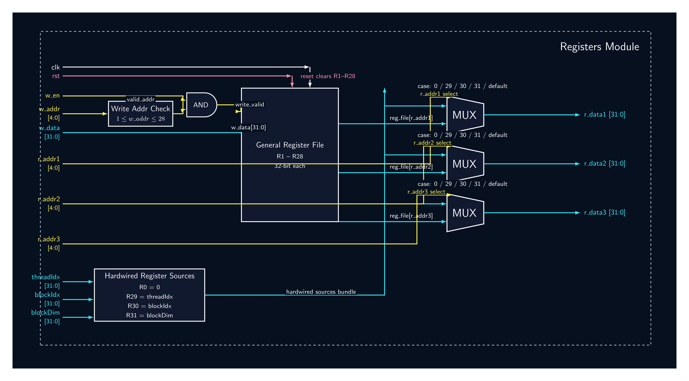

# Registers

## Overview

`registers` is the per-thread register file used inside each GPU core thread lane.

Each thread has its own private register file instance. The module provides:

```text
3 combinational read ports
1 synchronous write port
hardwired special registers
```

The register file contains 32 logical registers:

```text
R0  -> hardwired zero
R1-R28 -> writable general-purpose registers
R29 -> threadIdx / blockIdx helper
R30 -> blockIdx
R31 -> blockDim
```

Only registers `R1` through `R28` are physically writable. Registers `R0`, `R29`, `R30`, and `R31` are special read-only/hardwired registers.

## RTL schematic



If the image file in `assets/Images-Components/` has a different name, update the path above to match the actual filename.

## Source files

```text
Src/registers/register_file.sv
Src/registers/test_registers.py
```

## Position in the GPU

Each thread lane inside `core.sv` has one register file instance.

```text
decoder register addresses
        │
        ▼
register file
        │
        ├── r_data1 -> ALU operand1 / memory base address
        ├── r_data2 -> ALU operand2
        └── r_data3 -> ALU operand3 / store data
```

In the full per-thread datapath:

```text
decoder
  │
  ├── rs1_addr, rs2_addr, rs3_addr / rd_addr
  ▼
registers
  │
  ├── ALU operands
  ├── LSU address/data path
  └── writeback from ALU / LSU / CONST
```

Inside `core.sv`, each thread lane connects the register file like this:

```systemverilog
registers reg_file (
    .clk       (clk),
    .rst       (rst),
    .r_addr1   (rs1_addr),
    .r_addr2   (rs2_addr),
    .r_addr3   (mem_write_en ? rd_addr : rs3_addr),
    .w_addr    (rd_addr),
    .w_data    (write_data[i]),
    .w_en      (write_back_en_sched & write_back_en_dec & active_mask[i]),

    .threadIdx (32'(i)),
    .blockIdx  (blockIdx),
    .blockDim  (blockDim),
    .r_data1   (reg_data1[i]),
    .r_data2   (reg_data2[i]),
    .r_data3   (reg_data3[i])
);
```

## Module declaration

```systemverilog
(* syn_dont_touch = 1 *) module registers (
    input logic clk,
    input logic rst,
    input logic [4:0] r_addr1,
    input logic [4:0] r_addr2,
    input logic [4:0] r_addr3,
    input logic [4:0] w_addr,
    input logic [31:0] w_data,
    input logic w_en,
    input logic [31:0] threadIdx,
    input logic [31:0] blockIdx,
    input logic [31:0] blockDim,
    output logic [31:0] r_data1,
    output logic [31:0] r_data2,
    output logic [31:0] r_data3
);
```

## Port description

| Port        | Direction | Width | Description                       |
| ----------- | --------- | ----: | --------------------------------- |
| `clk`       | input     |     1 | Clock                             |
| `rst`       | input     |     1 | Reset                             |
| `r_addr1`   | input     |     5 | Read address for port 1           |
| `r_addr2`   | input     |     5 | Read address for port 2           |
| `r_addr3`   | input     |     5 | Read address for port 3           |
| `w_addr`    | input     |     5 | Write address                     |
| `w_data`    | input     |    32 | Write data                        |
| `w_en`      | input     |     1 | Write enable                      |
| `threadIdx` | input     |    32 | Hardware-injected thread index    |
| `blockIdx`  | input     |    32 | Hardware-injected block index     |
| `blockDim`  | input     |    32 | Hardware-injected block dimension |
| `r_data1`   | output    |    32 | Read data from port 1             |
| `r_data2`   | output    |    32 | Read data from port 2             |
| `r_data3`   | output    |    32 | Read data from port 3             |

## Register map

| Register | Name / Meaning            | Writable? | Read behavior                                           |
| -------: | ------------------------- | --------- | ------------------------------------------------------- |
|     `R0` | Zero register             | No        | Always returns `0`                                      |
| `R1-R28` | General-purpose registers | Yes       | Returns stored register value                           |
|    `R29` | Thread index helper       | No        | Returns `threadIdx`, or `blockIdx` when `blockDim == 1` |
|    `R30` | Block index               | No        | Returns `blockIdx`                                      |
|    `R31` | Block dimension           | No        | Returns `blockDim`                                      |

## Physical storage

The module declares storage for 32 registers:

```systemverilog
logic [31:0] reg_file [0:31];
```

However, only `R1` through `R28` are reset and writable.

```systemverilog
for (int i = 1; i < 29; i++) begin
    reg_file[i] <= 32'b0;
end
```

Writes are only accepted for:

```systemverilog
if (w_addr >= 1 && w_addr <= 28) begin
    reg_file[w_addr] <= w_data;
end
```

So the special registers cannot be overwritten by normal instructions.

## Special register behavior

## R0: zero register

`R0` always reads as zero:

```systemverilog
5'd0: r_data1 = 32'b0;
```

This is useful for instructions such as:

```text
CMP R1, R0
CONST-like zero usage
arithmetic with zero
```

Even if a write attempts to target `R0`, the write is ignored because only addresses `1` through `28` are writable.

## R29: thread index helper

`R29` normally returns `threadIdx`.

```systemverilog
logic [31:0] r29_value;
assign r29_value = (blockDim == 32'd1) ? blockIdx : threadIdx;
```

So:

```text
if blockDim > 1:
    R29 = threadIdx

if blockDim == 1:
    R29 = blockIdx
```

The `blockDim == 1` case is a helper for single-thread FPGA mode. In that mode, each block has one thread, so using `blockIdx` as the effective thread index makes FPGA behavior match the multi-thread simulation numerically.

## R30: block index

`R30` returns the current block index:

```systemverilog
5'd30: r_data1 = blockIdx;
```

This gives programs access to the assigned block ID.

## R31: block dimension

`R31` returns the current block dimension:

```systemverilog
5'd31: r_data1 = blockDim;
```

This gives programs access to the number of threads per block.

## Read behavior

The register file has three independent combinational read ports.

Each port uses the same special-register mapping.

Read port 1:

```systemverilog
always_comb begin : read_port_1
    case (r_addr1)
        5'd0:  r_data1 = 32'b0;
        5'd29: r_data1 = r29_value;
        5'd30: r_data1 = blockIdx;
        5'd31: r_data1 = blockDim;
        default: r_data1 = reg_file[r_addr1];
    endcase
end
```

Read port 2:

```systemverilog
always_comb begin : read_port_2
    case (r_addr2)
        5'd0:  r_data2 = 32'b0;
        5'd29: r_data2 = r29_value;
        5'd30: r_data2 = blockIdx;
        5'd31: r_data2 = blockDim;
        default: r_data2 = reg_file[r_addr2];
    endcase
end
```

Read port 3:

```systemverilog
always_comb begin : read_port_3
    case (r_addr3)
        5'd0:  r_data3 = 32'b0;
        5'd29: r_data3 = r29_value;
        5'd30: r_data3 = blockIdx;
        5'd31: r_data3 = blockDim;
        default: r_data3 = reg_file[r_addr3];
    endcase
end
```

Because reads are combinational, changing a read address updates the corresponding read data after combinational propagation delay.

## Write behavior

Writes are synchronous and occur on the rising edge of `clk`.

```systemverilog
always_ff @(posedge clk or posedge rst) begin
    if (rst) begin
        for (int i = 1; i < 29; i++) begin
            reg_file[i] <= 32'b0;
        end
    end else if (w_en) begin
        if (w_addr >= 1 && w_addr <= 28) begin
            reg_file[w_addr] <= w_data;
        end
    end
end
```

A write occurs only when:

```text
w_en = 1
w_addr is between 1 and 28
```

Invalid/special write addresses are ignored:

```text
R0  ignored
R29 ignored
R30 ignored
R31 ignored
```

## Reset behavior

On reset:

```text
R1-R28 -> 0
```

Special registers are not reset because they are not normal stored registers:

```text
R0  -> hardwired 0
R29 -> threadIdx or blockIdx helper
R30 -> blockIdx
R31 -> blockDim
```

Reset is asynchronous because the write/reset block uses:

```systemverilog
always_ff @(posedge clk or posedge rst)
```

## Interaction with core writeback

Inside `core.sv`, register write enable is gated by three conditions:

```systemverilog
.w_en(write_back_en_sched & write_back_en_dec & active_mask[i])
```

This means the register file writes only when:

```text
scheduler is in writeback/update phase
decoder says the instruction writes a register
thread lane is active
```

This is important because scheduler timing alone is not enough. Instructions like `BR`, `SYNC`, `STR`, and `RET` should not write registers.

## Interaction with load/store

The register file feeds the memory address and store-data path.

Address generation in `core.sv`:

```systemverilog
assign mem_addr[i] = reg_data1[i] + {{16{imm[15]}}, imm};
```

For loads/stores:

```text
reg_data1 -> base address
imm       -> offset
```

For stores, the core selects the third read-port address as:

```systemverilog
.r_addr3(mem_write_en ? rd_addr : rs3_addr)
```

This means store data comes from `rd_addr` through read port 3.

## Interaction with ALU

For ALU-style instructions:

```text
r_data1 -> operand1
r_data2 -> operand2
r_data3 -> operand3
```

The ALU result returns through the core writeback mux:

```systemverilog
assign write_data[i] =
    mem_read_en        ? lsu_read_data[i] :
    (opcode == 6'h11)  ? {16'b0, imm}     :
                          alu_result[i];
```

Then `write_data[i]` is written into `rd_addr` when the writeback enable is valid.

## Current RTL implementation

```systemverilog
logic [31:0] reg_file [0:31];

logic [31:0] r29_value;
assign r29_value = (blockDim == 32'd1) ? blockIdx : threadIdx;

always_ff @(posedge clk or posedge rst) begin
    if (rst) begin
        for (int i = 1; i < 29; i++) begin
            reg_file[i] <= 32'b0;
        end
    end else if (w_en) begin
        if (w_addr >= 1 && w_addr <= 28) begin
            reg_file[w_addr] <= w_data;
        end
    end
end
```

Each read port then maps `R0`, `R29`, `R30`, and `R31` specially and otherwise returns `reg_file[r_addr]`.

## Timing assumptions

The register file assumes:

- Write inputs are stable before the rising edge of clk.
- `w_en` is asserted only for instructions that should write registers.
- Read addresses are stable before downstream logic samples read data.
- Reads are combinational.
- Writes are synchronous.
- Special registers are read-only.
- Core logic gates `w_en` with `active_mask[i]` so inactive lanes do not write.

## Read-after-write behavior

The module does not implement explicit bypass/forwarding.

For a write followed by a read in the next cycle, the newly written value is visible.

For a same-cycle read and write to the same address, behavior depends on simulation/synthesis memory semantics and should not be relied on unless explicitly tested and defined later.

Current tests use the safe pattern:

```text
write on clock edge
then read after the write has completed
```

## Unit test

Unit test file:

```text
Src/registers/test_registers.py
```

## Current tests

| Test                     | What it checks                                                  |
| ------------------------ | --------------------------------------------------------------- |
| `test_registers`         | Reset clears normal registers                                   |
| `test_write_and_read`    | Writing to a general-purpose register and reading it back works |
| `test_R0_is_Zero`        | R0 remains zero even when written                               |
| `test_Hardware_injected` | R29 and R30 expose thread/block hardware values                 |

## `test_registers`

Checks that after reset:

```text
R5  = 0
R15 = 0
```

This verifies normal register reset behavior.

## `test_write_and_read`

Writes:

```text
w_addr = 5
w_data = 42
w_en   = 1
```

Then reads:

```text
r_addr1 = 5
```

Expected:

```text
r_data1 = 42
```

## `test_R0_is_Zero`

Attempts to write:

```text
w_addr = 0
w_data = 99
w_en   = 1
```

Then reads `R0`.

Expected:

```text
r_data1 = 0
```

This confirms that R0 is hardwired to zero and cannot be overwritten.

## `test_Hardware_injected`

Sets:

```text
threadIdx = 7
blockIdx  = 2
blockDim  = 4
```

Reads:

```text
R29 through r_addr1
R30 through r_addr2
```

Expected:

```text
r_data1 = 7
r_data2 = 2
```

Because `blockDim = 4`, R29 returns `threadIdx`.

## Testbench notes

The current testbench initializes most inputs, but does not always initialize `r_addr3`.

For cleaner future tests, initialize all read addresses:

```python
dut.r_addr1.value = 0
dut.r_addr2.value = 0
dut.r_addr3.value = 0
```

This avoids X/unknown behavior on read port 3 during simulation.

## Recommended additional tests

| Test                                 | Purpose                                                   |
| ------------------------------------ | --------------------------------------------------------- |
| `test_r31_blockDim`                  | Verify R31 returns `blockDim`                             |
| `test_r29_single_thread_mode`        | Verify R29 returns `blockIdx` when `blockDim == 1`        |
| `test_cannot_write_r29`              | Verify writes to R29 are ignored                          |
| `test_cannot_write_r30`              | Verify writes to R30 are ignored                          |
| `test_cannot_write_r31`              | Verify writes to R31 are ignored                          |
| `test_cannot_write_above_r28`        | Verify R29-R31 are protected                              |
| `test_all_read_ports`                | Verify r_data1, r_data2, and r_data3 all work             |
| `test_r_data3`                       | Specifically verify third read port behavior              |
| `test_no_write_when_w_en_low`        | Verify no write happens when `w_en = 0`                   |
| `test_reset_after_write`             | Verify reset clears previously written registers          |
| `test_same_cycle_read_write_defined` | Define or explicitly avoid same-cycle read/write behavior |

## Known pitfalls

Do not write to R0.

R0 is hardwired to zero and writes are ignored.

Do not treat R29 as always equal to `threadIdx`.

When `blockDim == 1`, R29 returns `blockIdx` for single-thread FPGA mode.

Do not write to R29-R31.

They are hardware-injected special registers, not normal general-purpose storage.

Do not remove the `blockDim == 1` helper unless the FPGA single-thread execution strategy changes.

It exists to make single-thread-per-block FPGA execution numerically match the multi-thread simulation.

Do not rely on same-cycle read/write behavior unless later defined with tests.

The current design has no explicit bypass network.

Do not forget to gate `w_en` in the core.

The register file itself only checks address legality. The core must ensure inactive lanes and non-writeback instructions do not write.

## Related integration tests

| Test                     | File                                      | What it proves                                                                         |
| ------------------------ | ----------------------------------------- | -------------------------------------------------------------------------------------- |
| `test_core_basic`        | `Src/core/test_core.py`                   | Register file participates in core execution                                           |
| `test_simt_relu`         | `Src/Top_level_GPU/test_top_level_gpu.py` | R29/thread index supports per-thread memory addressing                                 |
| `test_gpu_axel_program`  | `Src/Top_level_GPU/test_top_level_gpu.py` | Register file supports longer AXEL forward/update programs                             |
| `test_pc` / branch tests | `Src/pc/test_pc.py`                       | Register-produced CMP values eventually affect NZP/branch behavior through ALU/PC path |

## Last known status

```text
Status: passing

Verified with:
  cd ~/gpu-project
  make test

Current unit coverage:
  reset
  write/read
  R0 hardwired zero
  hardware-injected R29/R30
```

## Design summary

`registers` is a per-thread 32-register logical register file with three combinational read ports and one synchronous write port.

The most important architectural rules are:

```text
R0  = hardwired zero
R1-R28 = writable general-purpose registers
R29 = threadIdx, or blockIdx when blockDim == 1
R30 = blockIdx
R31 = blockDim
```

The most important integration rule is:

```text
core must gate w_en with scheduler writeback, decoder writeback, and active_mask
```
