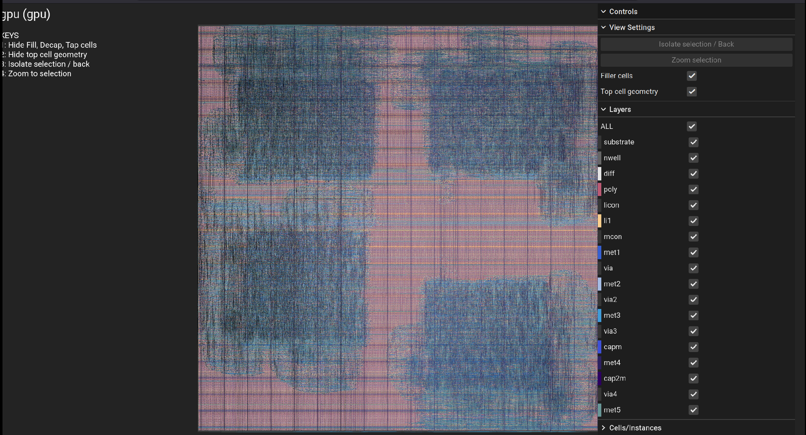

# OpenLane / Sky130A GDS

## Overview

This folder contains the ASIC layout output for the 32-bit Tiny GPU.

Two generations of the GPU have been taken through the open-source RTL-to-GDSII
flow using OpenLane 2.3.10 and the SkyWater Sky130A PDK.

| Generation | Architecture | Result |
|---|---|---|
| SIMD | 1 thread/core, 4 cores | GDS generated, LVS passed, 5 DRC violations |
| SIMT | 4 threads/core, 4 cores, warp stack, round-robin arbiter | GDS generated, **0 DRC violations**, LVS passed |

The SIMT result is the current primary deliverable.

---

## Layout Preview



The layout shows the fully routed GPU core. The dense logic region contains
the per-thread compute units (ALU, LSU, PC, register file), the warp stack,
the round-robin memory controller, scheduler, dispatcher, and DCR.

---

## File Index

| File | Description |
|---|---|
| `gpu_simt_sky130a.gds` | SIMT GPU, primary GDS, KLayout-ready |
| `gpu_simt_sky130a.magic.gds` | SIMT GPU, Magic-format GDS (use for DRC re-runs) |
| `gpu_simt_sky130a.def` | SIMT GPU, post-route DEF |
| `gpu_simd_sky130a.gds` | SIMD GPU, earlier baseline |
| `metrics_simt.json` | Full OpenLane 2 metrics snapshot (SIMT run) |
| `metrics_simt.csv` | Same metrics in CSV format |
| `reports/lvs_simt.rpt` | LVS report, Netgen (SIMT) |
| `reports/drc_violations.magic.rpt` | DRC report, Magic (SIMT, 0 violations) |
| `reports/gpu.drc` | Magic DRC output file (0 bytes = clean) |

---

## SIMT Results (Current)

Run: `RUN_2026-06-02_14-29-54`

| Metric | Value |
|---|---|
| Process | SkyWater Sky130A (130 nm) |
| Standard cell library | sky130_fd_sc_hd |
| Die area | 7.97 mm² (~2.82 x 2.82 mm) |
| Core area | 7.87 mm² |
| Core utilization | 27.9% |
| Total placed std cells | 300,884 |
| Logic cells (combinational) | 142,090 |
| Sequential cells (flip-flops) | 19,202 |
| LVS devices matched | 188,812 |
| LVS nets matched | 189,107 |
| Target clock | 40 MHz (25 ns period) |
| Achievable frequency (TT) | **~32.9 MHz** (25°C / 1.80V, post-route SDF STA) |
| Achievable frequency (SS) | **~18.6 MHz** (100°C / 1.60V, post-route SDF STA) |
| Critical path | Core datapath mux tree, ~31 ns (a2111oi_2 + a31oi_2) |
| Hold timing | Clean (WNS = 0) |
| Magic DRC violations | **0** |
| LVS result | **Circuits match uniquely** |
| Tool flow | OpenLane 2.3.10 / OpenROAD |

> **Timing note:** Post-route SDF-annotated STA was run using OpenSTA inside the
> OpenLane 2 Docker container. False paths applied: `rst` port (async reset treated
> as synchronous data by default) and `thread_keep_alive` port (synthetic XOR
> reduction chain, not a functional timing path). STA scripts and full logs are in
> [`../sta/`](../sta/).

---

## SIMD Results (Baseline)

| Metric | Value |
|---|---|
| Process | SkyWater Sky130A (130 nm) |
| Standard cell library | sky130_fd_sc_hd |
| Chip area | 1.977 mm² |
| Standard cells | 204,938 |
| Flip-flops | 16,138 |
| Target clock | 40 MHz (25 ns period) |
| Worst setup slack | +8.01 ns |
| Estimated max frequency | ~59 MHz |
| Total negative slack | 0 ps |
| LVS devices matched | 171,278 |
| LVS nets matched | 171,969 |
| LVS result | Passed |
| Magic DRC violations | 5 |
| KLayout DRC violations | 1 |

---

## SIMD vs SIMT Comparison

| Metric | SIMD | SIMT |
|---|---|---|
| Architecture | 1 thread/core | 4 threads/core + warp stack + round-robin arbiter |
| Chip/die area | 1.977 mm² | 7.97 mm² |
| Core utilization | n/a | 27.9% |
| Total std cells | 204,938 | 300,884 |
| Flip-flops | 16,138 | 19,202 |
| LVS devices | 171,278 | 188,812 |
| LVS result | Passed | Passed |
| Magic DRC violations | 5 | **0** |
| Timing WNS | +8.01 ns | -5.40 ns (TT, post-route STA) |
| Achievable frequency | ~59 MHz | ~32.9 MHz (TT) / ~18.6 MHz (SS) |

The SIMT die is larger because the floorplan was sized conservatively
(27.9% utilization) to ensure routing convergence on a consumer laptop.
A future tighter floorplan pass would reduce die area significantly.

---

## Status Summary

### SIMT (current)

```
Synthesis:         passed
Placement:         passed
CTS:               passed
Global routing:    passed
Detailed routing:  passed
Magic DRC:         0 violations (clean)
LVS:               passed, circuits match uniquely
Post-route STA:    completed (TT: ~32.9 MHz, SS: ~18.6 MHz)
GDS generated:     yes
```

### SIMD (baseline)

```
Synthesis:        passed
Placement:        passed
CTS:              passed
Global routing:   passed
Detailed routing: passed
Magic DRC:        5 violations
KLayout DRC:      1 violation
LVS:              passed
GDS generated:    yes
```

---

## Design Scale

The SIMT GPU is not a toy netlist.

```
188,812 LVS-verified devices
300,884 placed standard cells (including fill and tap)
7.97 mm² die area
~32.9 MHz achievable clock frequency (TT corner, post-route SDF STA)
```

At this scale, routing runtime, memory pressure, OpenROAD stability,
and resizer behavior all became major practical issues during the flow.

---

## Final Working OpenLane 2 Config (SIMT)

The SIMT run required explicitly defining `meta.flow` to exclude the
antenna-checker step, which crashed after global routing.

```json
{
    "meta": {
        "version": 2,
        "flow": [
            "Yosys.Synthesis",
            "OpenROAD.CheckSDCFiles",
            "OpenROAD.Floorplan",
            "OpenROAD.TapEndcapInsertion",
            "OpenROAD.GeneratePDN",
            "OpenROAD.IOPlacement",
            "OpenROAD.GlobalPlacement",
            "Odb.ManualGlobalPlacement",
            "OpenROAD.DetailedPlacement",
            "OpenROAD.CTS",
            "OpenROAD.GlobalRouting",
            "OpenROAD.DetailedRouting",
            "OpenROAD.FillInsertion",
            "Magic.StreamOut",
            "Magic.DRC",
            "Magic.SpiceExtraction",
            "Netgen.LVS"
        ]
    },
    "DESIGN_NAME": "gpu",
    "VERILOG_FILES": "dir::src/*.v",
    "CLOCK_PORT": "clk",
    "CLOCK_NET": "clk",
    "CLOCK_PERIOD": 25,
    "FP_CORE_UTIL": 25,
    "PL_TARGET_DENSITY_PCT": 35,
    "SYNTH_STRATEGY": "AREA 0",
    "MAX_FANOUT_CONSTRAINT": 8,
    "RUN_POST_GPL_DESIGN_REPAIR": false,
    "RUN_POST_CTS_RESIZER_TIMING": false,
    "GRT_RESIZER_DESIGN_OPTIMIZATIONS": false,
    "GRT_RESIZER_TIMING_OPTIMIZATIONS": false,
    "GRT_ADJUSTMENT": 0.1,
    "GRT_OVERFLOW_ITERS": 100,
    "DRT_THREADS": 1,
    "PDK": "sky130A",
    "STD_CELL_LIBRARY": "sky130_fd_sc_hd"
}
```

---

## Key Config Decisions

### Resizers disabled

The SIMD run had strong positive slack after synthesis (+8.01 ns).
Despite that, the default flow inserted ~44,920 timing repair buffers,
bloating the design from ~204K to ~293K cells.

This made routing harder with no timing benefit.
The correct move was to disable all major resizer passes.

```json
"RUN_POST_GPL_DESIGN_REPAIR": false,
"RUN_POST_CTS_RESIZER_TIMING": false,
"GRT_RESIZER_DESIGN_OPTIMIZATIONS": false,
"GRT_RESIZER_TIMING_OPTIMIZATIONS": false
```

### Routing adjustment

```json
"GRT_ADJUSTMENT": 0.1
```

Lower value gives the global router access to more routing tracks.
Default values were too conservative for this design and caused congestion failures.

### Single-threaded detailed routing

```json
"DRT_THREADS": 1
```

Reduced memory pressure on consumer hardware. Routing took longer
but completed without stability issues.

### Antenna checker excluded (SIMT only)

The antenna checker crashed deterministically after global routing on the SIMT run.
Rather than debugging the crash, the step was excluded from `meta.flow`.
Magic DRC confirmed 0 violations on the final layout.

### DIV/MOD replaced with 32'b0

Sky130A has no hardware divider cells. The synthesis target replaces
opcodes `6'h04` (DIV) and `6'h05` (MOD) with `result = 32'b0`.
This eliminates deep combinational paths from single-cycle division.
Future work should implement these as iterative multi-cycle units.

---

## Post-Route STA

Post-route SDF-annotated timing analysis was run using OpenSTA inside the
OpenLane 2 Docker container (`/nix/store/.../bin/sta`).

Two SDF corners were analyzed:

| Corner | Conditions | WNS | TNS | Achievable freq |
|---|---|---|---|---|
| TT | 25°C / 1.80V | -5.40 ns | -6828 ns | ~32.9 MHz |
| SS | 100°C / 1.60V | -28.82 ns | -167428 ns | ~18.6 MHz |

Critical path (both corners): `_344375_` (FF) to `_343054_` (FF) through
a wide combinational mux tree. Dominated by two cells:

- `sky130_fd_sc_hd__a2111oi_2`: 9.44 ns (TT) / 15.82 ns (SS)
- `sky130_fd_sc_hd__a31oi_2`: 7.34 ns (TT) / 8.78 ns (SS)

These two cells alone consume 16.8 ns of the 25 ns budget in TT.
This is a Yosys synthesis artifact (wide mux mapped to complex compound gates
instead of a balanced tree). A re-synthesis pass with size/area constraints
targeting these specific cells would be the most direct fix.

False paths applied:
- `set_false_path -from [get_ports rst]` — async reset treated as synchronous data by default
- `set_false_path -to [get_ports thread_keep_alive]` — synthetic XOR reduction chain

STA scripts: [`../sta/sta_tt.tcl`](../sta/sta_tt.tcl), [`../sta/sta_ss.tcl`](../sta/sta_ss.tcl)

---

## Toolchain

| Tool | Version |
|---|---|
| OpenLane | 2.3.10 |
| Docker image | `ghcr.io/efabless/openlane2:2.3.10` |
| Synthesis | Yosys |
| Place and route | OpenROAD / TritonRoute |
| DRC | Magic |
| LVS | Netgen |
| STA | OpenSTA (inside OpenLane 2 container) |
| PDK | sky130A |

---

## RTL Preparation

Before running the ASIC flow, the multi-file SystemVerilog RTL was converted
to a single flat Verilog file using `sv2v`:

```bash
sv2v \
  Src/alu/alu.sv \
  Src/registers/register_file.sv \
  Src/pc/pc.sv \
  Src/decoder/decoder.sv \
  Src/fetcher/fetcher.sv \
  Src/lsu/lsu.sv \
  Src/memory_controller/mem_controller.sv \
  Src/warp_stack/warp_stack.sv \
  Src/scheduler/scheduler.sv \
  Src/core/core.sv \
  Src/dispatcher/dispatcher.sv \
  Src/device_control_register/dcr.sv \
  Src/Top_level_GPU/top_level_gpu.sv \
  -w fpga/gpu_combined.v
```

Post-conversion patch applied to `gpu_combined.v` before synthesis:

```bash
# Replace DIV with 32'b0
sed -i "s|result = operand1 / operand2;|result = 32'b0;|" gpu_combined.v

# Replace MOD with 32'b0
sed -i "s|result = operand1 % operand2;|result = 32'b0;|" gpu_combined.v
```

---

## OpenLane 2 Docker Command

Full run:

```bash
cd ~/ol2-gpu

docker run --rm \
  -v $HOME:$HOME \
  -e PDK_ROOT=$HOME/pdks2 \
  -w $(pwd) \
  --user $(id -u):$(id -g) \
  --network host \
  ghcr.io/efabless/openlane2:2.3.10 \
  python -m openlane \
  config.json 2>&1 | tee ~/ol2_run.log
```

Resume from a specific step (use step names, not numbers):

```bash
docker run --rm \
  -v $HOME:$HOME \
  -e PDK_ROOT=$HOME/pdks2 \
  -w $(pwd) \
  --user $(id -u):$(id -g) \
  --network host \
  ghcr.io/efabless/openlane2:2.3.10 \
  python -m openlane \
  --from OpenROAD.DetailedRouting \
  --last-run \
  config.json 2>&1 | tee ~/ol2_resume.log
```

Note: numeric step IDs (`--from 37`) are not supported in OpenLane 2.3.10.
Use the step class names from `meta.flow` above.

---

## Viewing the GDS

```bash
# Install KLayout if needed
sudo apt install klayout

# Open SIMT layout
klayout gds/gpu_simt_sky130a.gds

# Open SIMD layout (older baseline)
klayout gds/gpu_simd_sky130a.gds
```

Enable met1 through met5 in the Layer panel to inspect routing layers.

---

## WSL2 Note

Running a 200K+ cell OpenLane flow under WSL2 causes severe memory pressure
and system instability. The SIMT run was completed on native Ubuntu dual-boot.

```
Do not run this flow under WSL2.
Use native Ubuntu for OpenLane runs at this design scale.
```

---

## Tapeout Readiness Checklist

| Item | SIMD | SIMT |
|---|---|---|
| RTL synthesis | Done | Done |
| Placement | Done | Done |
| CTS | Done | Done |
| Global routing | Done | Done |
| Detailed routing | Done | Done |
| LVS | Passed | Passed |
| GDS generated | Yes | Yes |
| Magic DRC clean | No (5 violations) | **Yes (0 violations)** |
| Antenna report | Not clean | Excluded from flow (Magic DRC clean) |
| Post-route STA | Passed (WNS +8.01 ns) | **Done (TT: ~32.9 MHz, SS: ~18.6 MHz)** |
| Power signoff | Not documented | Not documented |
| DIV/MOD | Replaced with 32'b0 | Replaced with 32'b0 |
| Run reproducible | Config archived | Config archived in this repo |
| Tapeout-ready | No | Not yet |

The SIMT layout is the strongest result: 0 DRC violations, LVS clean, post-route STA complete.
Remaining items before tapeout readiness: power signoff and critical path improvement.

---

## Lessons Learned

### 1. Disable resizers when synthesis slack is already positive

Letting OpenLane insert tens of thousands of repair buffers into an
already-timing-clean design creates congestion, not improvement.
For this GPU, disabling all major resizer passes was the correct move.

### 2. OpenLane 2 is more stable than OpenLane 1 for large designs

OpenLane 1 reached a deterministic OpenROAD segfault during routing.
OpenLane 2.3.10 completed the full flow. For future Sky130 work, start with OpenLane 2.

### 3. Native Ubuntu is required at this design scale

WSL2 caused repeated system instability under Docker/OpenROAD memory load.
Native Ubuntu eliminated all stability issues.

### 4. Explicit `meta.flow` gives fine-grained step control

Excluding a crashing step (antenna checker) by omitting it from `meta.flow`
is cleaner than fighting OpenLane 1-style `RUN_*` variables.

### 5. Single-threaded detailed routing is slower but stable

`DRT_THREADS = 1` made the run stable on consumer hardware.
Use more threads only on machines with substantial RAM headroom (32 GB+).

### 6. DIV/MOD need iterative hardware implementations

Single-cycle combinational dividers are not suitable for ASIC implementation
at this process node and design scale. Future versions should implement these
as multi-cycle iterative units.

### 7. Mid-PNR WNS estimates are optimistic

The mid-PNR WNS of -547 ps implied ~39.1 MHz. Post-route SDF-annotated STA
on the final netlist gave -5.40 ns WNS and ~32.9 MHz. Always run post-route STA
before quoting a frequency number.

---

## Recommended Future Work

1. Tighten floorplan (raise `FP_CORE_UTIL`) to reduce die area from 7.97 mm².
2. Re-synthesize with constraints targeting the a2111oi/a31oi critical path to improve frequency.
3. Implement DIV/MOD as iterative multi-cycle hardware units.
4. Add power analysis from OpenROAD reports.
5. Add area breakdown by module from Yosys/OpenROAD hierarchy reports.
6. Re-run antenna checker with correct config once root cause is known.
7. Add final KLayout screenshot of SIMT layout to `assets/gds/`.

---

## Related Documentation

| Document | Path |
|---|---|
| Root project README | `../README.md` |
| Architecture documentation | `../docs/architecture.md` |
| ISA documentation | `../docs/isa.md` |
| Memory map | `../docs/memory_map.md` |
| Debug log | `../docs/debug_log.md` |
| FPGA documentation | `../fpga/README.md` |
| Post-route STA scripts | `../sta/` |
| Reports folder | `../reports/` |

---

## Summary

The 32-bit Tiny GPU has been successfully implemented in SkyWater Sky130A
through the open-source ASIC flow twice: first as a SIMD design,
then as a full SIMT design with warp stack and round-robin memory arbitration.

SIMT result:

```
188,812 LVS-verified devices
7.97 mm² die area
~32.9 MHz achievable frequency (TT corner, post-route SDF STA)
0 Magic DRC violations
LVS: circuits match uniquely
```

The SIMT implementation is the first to achieve a fully clean DRC result,
confirming that the SIMT RTL and the open-source Sky130A flow are compatible
at production design scale.